**作者**

Shangmin Guo@爱丁堡大学 | s.guo@ed.ac.uk （注：这个输入中，人名和大学名保留英文，因为直接音译可能会引起误解，邮箱地址也保留原样）

Wei Xiong@伊利诺伊大学厄巴纳-香槟分校 | wx13@illinois.edu （注：此翻译中，“University of Illinois Urbana-Champaign”为固定名称，保留原文更合适，所以在翻译中保留了英文表述）

（按字母顺序）

_注意：此博客文章最初发布于 Notion。_

**鸣谢；致谢；感谢**

感谢 Salesforce 的 Hanze Dong、Google 的 Tianqi Liu、Ernie 代码团队的 Wei Shen、UIUC 的 Haoxiang Wang，对本博客早期草稿提供的深刻反馈。

**致读者：**

*   如果您认为本文的任何部分可以改进，请发送电子邮件！

**TL; DR：意为“太长不看；简而言之”，在这种情况下，作为一个常见的缩写，保留原文更为合适。所以答案为：TL; DR**

从人类反馈中进行强化学习（Reinforcement learning from human feedback，RLHF）是一种使生成模型的输出更符合人类偏好的领先技术，并且在 OpenAI 的 ChatGPT、Anthropic 的 Claude 以及 Google 的 Gemini 中取得了巨大的成功。受这些成功的启发，偏好优化（一个稍微更通用的术语，也包含无强化学习算法）在过去一年中引起了极大的关注。在这个博客中，我们旨在对这个令人兴奋的领域的前沿研究进行全面介绍，探讨正在进行的挑战，并讨论未来有趣的研究问题。

1 先决条件
======

1.0 对齐目标
--------

我们从阐释使人工智能（AI）系统保持一致的概念开始。我们的讨论在很大程度上遵循了伊森·加布里埃尔（Iason Gabriel）的《人工智能、价值观与一致性》的工作。

人工智能对齐的总体目标是确保人工智能系统按照人类的指令、意图、价值观和道德规范行事。其目的是创建不仅能有效执行任务，而且能理解并与人类意图、道德原则和社会规范的更广泛背景保持一致的人工智能。随着人工智能技术变得更加先进和自主，这一点至关重要，以防止意外后果并确保人工智能对人类福祉和社会进步做出积极贡献。

❗ 我们在此强调，对齐是为了限制人工智能的行为，使其遵循人类的指令/价值观/道德规范，而不是为了提高人工智能在特定任务上的性能。或者，换句话说，对齐是关于微调人工智能以实现特定目标。

然而，具体的校准目标目前仍存在争议，并且会根据不同的伦理或道德哲学（例如后果主义、义务论和德性伦理学）而有很大差异。下面，我们仅列出伊森讨论过的几个选项。

> 指令：该代理会按照我指示的去做

> 表达的意图：该代理会按照我的意图去做

> 显示性偏好：主体的行为显示出我所偏好的东西

> 知情偏好或愿望：如果我是理性且知情的，该主体会做我希望它做的事

> 利益或福祉：代理人会做符合我利益的事，或者从客观角度来说，做对我最有利的事

> 价值观：该智能体去做其在道德上应当做的事情，这是由个人或社会所定义的

由于我们更关注人工智能对齐的技术，我们略过了上述要点的细节。但是，对于对关于对齐的伦理和哲学讨论感兴趣的读者，我们强烈推荐 Iason 的论文《人工智能、价值观与对齐》以及 Paul Christiano 在 https://ai-alignment.com 上的博客。

在本博客的后续内容中，我们主要讨论对齐大型语言模型的技术（LLMs）。

### 为什么对齐在 SFT 之后？

要开发一个LLM，通常有三个步骤。1）预训练；2）有监督/指令微调；3）对齐。更多细节在下面的 1.1 节中介绍。

我们想从阐明 SFT 和对齐之间的关系开始。

给定伊森上述的六种对齐目标中的任何一种，对于LLM要实现对齐，一个先决条件是能够严格遵循用户的指示。因此，在我们将LLMs朝着人类的偏好/兴趣/价值观进行对齐之前，模型需要能够理解并遵循这些指示。到目前为止，最有效和有前途的方法可能是 SFT。

⚠️ 注：我们尝试跳过 SFT 并通过 DPO（一种特定的对齐算法）仅对预训练模型 LLM 进行对齐。我们发现，这种方法可以提高 LLMs 的指令遵循能力，但效率极低，因为模型需要整整一个训练周期才能理解任务，而不论该模型是否能够生成适当的响应。

1.1 预训练与遵循指令的微调
---------------

我们将LLM训练流程总结如下。

*   自回归语言模型一次生成一个标记，每个新标记都依赖于之前的标记。例如，对于一个句子 $s = [s_1, s_2, \cdots, s_{|s|}]$ ，概率被分解为
    
    $$
    P(s) = P(s_1) \times P(s_2 |s_1)  \times \underbrace{P(s_3|s_{1:2})}_{\text{Conditioned on the tokens came before}} \times \cdots \times P(s_{|s|}|s_{1:|s|-1})
    $$
    
    按照文献中的惯例，我们在后续讨论中使用 $\pi$ 来表示语言模型。
    
*   预训练：此步骤的目标是使一个未标记的 $N_1$ 句子 $\{s^i\}_{i=1}^{N_1}$ 语料库的可能性最大化，通常是通过最小化以下负对数似然（NLL）目标来实现
    
    $$
    \min_{\pi} \mathcal{L}(\pi) = - \sum_{i=1}^{N_1} \underbrace{\sum_{j=1}^{|s^i|} \log \pi(s_j^i|s^i_{1:j-1})}_{\text{log-likelihood of one sentence for the autoregressive model}}.
    $$
    
    直观地说，预训练是为了让LLMs适应人类语言的通用分布，并获得该分布中所蕴含的“知识”。
    
*   Supervised/Instruction-following Fine-tuning：在预训练之后，一个LLM会在一组 $N_2 (N_2 \ll N_1)$ 提示 $\{x\}$ 以及来自人类标注者的带标签的响应 $\{a\}$ 上进行微调，通过最小化以下 NLL 目标： （注：原文中LLM、 $N_2 (N_2 \ll N_1)$ 、 $\{x\}$ 、 $\{a\}$ 可能是特定的术语或代码，在没有更多上下文的情况下，无法进行准确翻译，所以保留原样。）
    
    $$
    \min_{\pi} \mathcal{L}(\pi) -\sum_{i=1}^{N_2} \underbrace{\sum_{j=1}^{a^i} \log \pi(a_j^i| a_{1:j-1}^i, x^i)}_{\text{log-likelihood of one completion for the autoregressive model.}}.
    $$
    
    在 $\pi$ 被初始化为预训练模型的副本的情况下。直观地说，这一步是为了教导模型遵循人类的指令。
    
*   对齐（偏好优化）：在进行 SFT 之后，部署LLM之前的最后一步是 RLHF。简而言之，偏好优化是使输出生成适应人类价值观的主导技术，并且是使 Chat-GPT 从 GPT-3 发展而来的关键组成部分。
    
    基于经典强化学习的偏好优化（被称为从人类反馈中进行强化学习，RLHF）最初由 Christiano 等人（2017 年）和 Stiennon 等人（2020 年）开发，随后 Instruct-GPT 和 Claude 对其进行了进一步发展。最近，另一系列工作专注于设计无需强化学习的算法，直接根据人类偏好优化LLMs 。 （注：原文中LLMs的含义不太明确，可能存在错误或特定上下文信息缺失，因此在翻译中保留了原样。）
    
    无论通过何种方式，这种对齐背后的核心思想是在以下内容中学习“ `human value functions'' from the preference data, so we'll refer this step as` 偏好优化”。
    

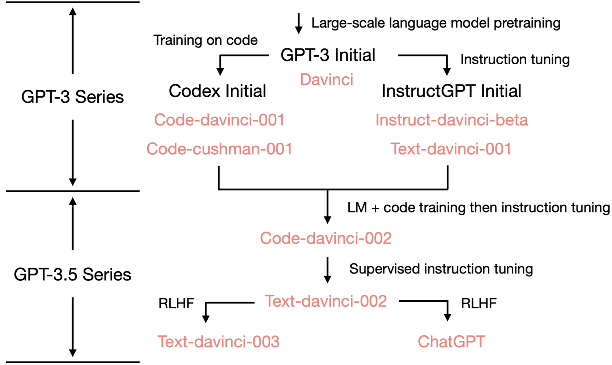

（该图借自姚福的博客）

### 为什么监督/指令微调不足以实现对齐？

关于监督/指令微调（SFT）和对齐的另一个自然问题是，仅 SFT 是否可以实现对齐目标。我们在此提供一些来自我们独立博客的初步结果，以支持仅 SFT 可能不足以实现 LLMs 的对齐。

我们的关键假设是：

给定一组由目标函数 $f_{tgt}$ 生成的样本 $\mathbb{D}=\{(x_i,y_i)\}_{i=1}^N$ ，如果我们在 $\mathbb{D}$ 上训练一个模型 $\pi$ ， $\pi$ 不一定在学习 $f_{tgt}$ 。相反， $\pi$ 可能会学习一个更简单的函数 $f_{smp}$ ，该函数也可以生成 $\mathbb{D}$ 。

为了验证上述假设，给定一个提示 $x_i$ 和相应的学习目标 $y_i^+$ ，然后我们针对相同的提示 $x_i$ 生成以下几种响应：

1. 被拒绝的响应 $y_i^-$ ：一种也从 $f_{tgt}(x_i)$ 中抽样得到的响应，但与 $y_i^+$ 相比，人类对其偏好程度较低。
2. 被拒绝的回应 $\tilde{y}_i^-$ 的释义：由 Gemini-Pro 完成的被拒绝的回应 $y_i^-$ 的释义。
3. 变异响应 $y_i'$ ：由 Gemini-Pro 生成的针对 $x_i$ 的响应，因此 $y_i'\in\mathbb{D}$ ，但应超出 $f_{tgt}(x_i)$ 指定的分布。
4. 随机响应 $y_j^+$ ：对随机选择的提示的首选响应 $x_j$ 。注意，这里的索引是 $j$ 而不是 $i$ ，因此 $y_j^+\in\mathbb{D}$ ，但它是从不同的 $x_j$ 映射而来的。 $y_j^+$ 应该完全不在 $f_{tgt}(x_i)$ 指定的分布之外。
5. 未响应 $\bar{y}_i$ ：这是由 Gemini-Pro 生成的一个随机句子，因此不是响应，即 $\bar{y}_i\notin\mathbb{D}$ 。

现在，让我们看看上述各类反应的可能性如何随 SFT 变化。模型 $\pi$ 是 Pythia - 2.8b。注意，学习目标仅为“SFT 目标” $y_i^+$ ！

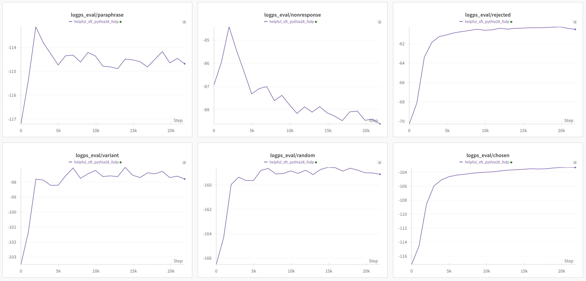

总之，我们观察到以下三点：

*   除了“无回应” $\bar{y}_i$ 外，所有在 $\log \pi(\cdot|x_i)$ 的对数概率在 SFT 中都有所增加。
*   不同种类反应的对数概率以不同程度增加。
    *   从高到低的对数概率增量为： $\Delta\log \pi(y_i^+|x_i)$ $> \Delta\log \pi(y_i^-|x_i)$ $>\Delta\log \pi(y_j^+|x_i)$ $>\Delta\log \pi(\tilde{y}_i^-|x_i)$ $>\Delta\log \pi(y_i'|x_i)$ $>\Delta\log \pi(\bar{y}_i|x_i)$ 。
*   “被拒绝的回应” $\log \pi(y_i^-|x_i)$ 的对数概率总是高于“恰当的回应” $\log \pi(y_i^+|x_i)$ 的对数概率。

上述结果表明，SFT 实际上是在学习生成一般性的“响应”，而不仅仅是对 $x_i$ 的“响应”，因为 $y_j^+$ 也有所增加。更有趣的是，“被拒绝的响应” $y_i^-$ 的对数概率始终高于“正确响应” $y_i^+$ 的对数概率，这表明仅 SFT 无法实现LLMs的对齐。

⚠️我们在有限的规模下进行了上述实验，上述结论是否更普遍地成立仍需探索。如果您有兴趣深入研究，请随时与我们联系，我们很乐意合作探讨这个问题！

1.2 偏好数据收集、奖励以及布拉德利 - 特里模型
--------------------------

我们正式定义一些用于后续讨论的有用的概念和观念。

*   初始模型：我们假设我们有一个初始检查点 $\pi_0$ ，它经过了预训练和有监督的微调（指令跟随训练）。
    
*   偏好信号：与我们从有标签数据中学习的 SFT 不同，RLHF 从相对反馈中学习。正式地，对于每个比较对 $(x, a^1, a^2)$ ，偏好预言机满足 $\mathcal{P}(x,a^1,a^2) = P(a^1 \succ a^2 | x) \in [0,1]$ ，表示在给定提示 $x$ 的情况下， $a^1$ 相对于 $a^2$ 被偏好的概率。
    
*   偏好数据收集：我们假设提示是从分布 $d_0$ 中采样的，并且我们有两个行为策略 $(\pi^1, \pi^2)$ ：
    
    $$
    x \sim d_0, (a^1,a^2) \sim (\pi^1,\pi^2), \qquad y \sim \mathrm{Bernoulli}\big(\mathcal{P}(x,a^1,a^2)\big).
    $$
    
    其中随机偏好信号 $y=1$ 表示 $a^1$ 更好， $y=0$ 表示 $a^2$ 更好。
    

我们将LLM的三个学习阶段总结如下。

<table data-immersive-translate-walked="bb3e1e60-8177-4a45-950f-013d9370f6ba"><thead data-immersive-translate-walked="bb3e1e60-8177-4a45-950f-013d9370f6ba"><tr data-immersive-translate-walked="bb3e1e60-8177-4a45-950f-013d9370f6ba"><th data-immersive-translate-walked="bb3e1e60-8177-4a45-950f-013d9370f6ba"></th><th data-immersive-translate-walked="bb3e1e60-8177-4a45-950f-013d9370f6ba" data-immersive-translate-paragraph="1"> 数据格式</th><th data-immersive-translate-walked="bb3e1e60-8177-4a45-950f-013d9370f6ba" data-immersive-translate-paragraph="1"> 学习目标</th></tr></thead><tbody data-immersive-translate-walked="bb3e1e60-8177-4a45-950f-013d9370f6ba"><tr data-immersive-translate-walked="bb3e1e60-8177-4a45-950f-013d9370f6ba"><td data-immersive-translate-walked="bb3e1e60-8177-4a45-950f-013d9370f6ba" data-immersive-translate-paragraph="1"> 预训练</td><td data-immersive-translate-walked="bb3e1e60-8177-4a45-950f-013d9370f6ba" data-immersive-translate-paragraph="1"> 大量未标注的数据</td><td data-immersive-translate-walked="bb3e1e60-8177-4a45-950f-013d9370f6ba" data-immersive-translate-paragraph="1"> 适用于人类语言的通用分布并获取知识。</td></tr><tr data-immersive-translate-walked="bb3e1e60-8177-4a45-950f-013d9370f6ba"><td>SFT</td><td data-immersive-translate-walked="bb3e1e60-8177-4a45-950f-013d9370f6ba" data-immersive-translate-paragraph="1"> a collection of prompt-response pair <mjx-container data-immersive-translate-walked="bb3e1e60-8177-4a45-950f-013d9370f6ba" style="font-size: 116.9%; position: relative;" imt-original-formula="(x, a)" ctxtmenu_counter="71" tabindex="0" jax="CHTML" class="MathJax CtxtMenu_Attached_0 notranslate imtOriginalFormula72"><mjx-math aria-hidden="true" class="MJX-TEX"><mjx-mo class="mjx-n"><mjx-c class="mjx-c28"></mjx-c></mjx-mo><mjx-mi class="mjx-i"><mjx-c class="mjx-c1D465 TEX-I"></mjx-c></mjx-mi><mjx-mo class="mjx-n"><mjx-c class="mjx-c2C"></mjx-c></mjx-mo><mjx-mi space="2" class="mjx-i"><mjx-c class="mjx-c1D44E TEX-I"></mjx-c></mjx-mi><mjx-mo class="mjx-n"><mjx-c class="mjx-c29"></mjx-c></mjx-mo></mjx-math><mjx-assistive-mml display="inline" unselectable="on"><math xmlns="http://www.w3.org/1998/Math/MathML"><mo stretchy="false">(</mo><mi>x</mi><mo>,</mo><mi>a</mi><mo stretchy="false">)</mo></math></mjx-assistive-mml></mjx-container> （此内容为英文表述，在特定语境下可能具有特定含义，若该表述为专业术语、代码或在特定上下文中具有特定意义而无需翻译，可保留原文。此处按字面意思翻译为：） 一组提示 - 响应对 <mjx-container data-immersive-translate-walked="bb3e1e60-8177-4a45-950f-013d9370f6ba" style="font-size: 116.9%; position: relative;" imt-original-formula="(x, a)" ctxtmenu_counter="71" tabindex="0" jax="CHTML" class="MathJax CtxtMenu_Attached_0 notranslate imtOriginalFormula72"><mjx-math aria-hidden="true" class="MJX-TEX"><mjx-mo class="mjx-n"><mjx-c class="mjx-c28"></mjx-c></mjx-mo><mjx-mi class="mjx-i"><mjx-c class="mjx-c1D465 TEX-I"></mjx-c></mjx-mi><mjx-mo class="mjx-n"><mjx-c class="mjx-c2C"></mjx-c></mjx-mo><mjx-mi space="2" class="mjx-i"><mjx-c class="mjx-c1D44E TEX-I"></mjx-c></mjx-mi><mjx-mo class="mjx-n"><mjx-c class="mjx-c29"></mjx-c></mjx-mo></mjx-math><mjx-assistive-mml display="inline" unselectable="on"><math xmlns="http://www.w3.org/1998/Math/MathML"><mo stretchy="false">(</mo><mi>x</mi><mo>,</mo><mi>a</mi><mo stretchy="false">)</mo></math></mjx-assistive-mml></mjx-container></td><td data-immersive-translate-walked="bb3e1e60-8177-4a45-950f-013d9370f6ba" data-immersive-translate-paragraph="1"> 提高模型遵循指令的能力</td></tr><tr data-immersive-translate-walked="bb3e1e60-8177-4a45-950f-013d9370f6ba"><td data-immersive-translate-walked="bb3e1e60-8177-4a45-950f-013d9370f6ba" data-immersive-translate-paragraph="1"> 偏好优化</td><td data-immersive-translate-walked="bb3e1e60-8177-4a45-950f-013d9370f6ba" data-immersive-translate-paragraph="1"> <mjx-container data-immersive-translate-walked="bb3e1e60-8177-4a45-950f-013d9370f6ba" style="font-size: 116.9%; position: relative;" imt-original-formula="(x,a^+,a^-)" ctxtmenu_counter="72" tabindex="0" jax="CHTML" class="MathJax CtxtMenu_Attached_0 notranslate imtOriginalFormula73"><mjx-math aria-hidden="true" class="MJX-TEX"><mjx-mo class="mjx-n"><mjx-c class="mjx-c28"></mjx-c></mjx-mo><mjx-mi class="mjx-i"><mjx-c class="mjx-c1D465 TEX-I"></mjx-c></mjx-mi><mjx-mo class="mjx-n"><mjx-c class="mjx-c2C"></mjx-c></mjx-mo><mjx-msup space="2"><mjx-mi class="mjx-i"><mjx-c class="mjx-c1D44E TEX-I"></mjx-c></mjx-mi><mjx-script style="vertical-align: 0.363em;"><mjx-mo size="s" class="mjx-n"><mjx-c class="mjx-c2B"></mjx-c></mjx-mo></mjx-script></mjx-msup><mjx-mo class="mjx-n"><mjx-c class="mjx-c2C"></mjx-c></mjx-mo><mjx-msup space="2"><mjx-mi class="mjx-i"><mjx-c class="mjx-c1D44E TEX-I"></mjx-c></mjx-mi><mjx-script style="vertical-align: 0.363em;"><mjx-mo size="s" class="mjx-n"><mjx-c class="mjx-c2212"></mjx-c></mjx-mo></mjx-script></mjx-msup><mjx-mo class="mjx-n"><mjx-c class="mjx-c29"></mjx-c></mjx-mo></mjx-math><mjx-assistive-mml display="inline" unselectable="on"><math xmlns="http://www.w3.org/1998/Math/MathML"><mo stretchy="false">(</mo><mi>x</mi><mo>,</mo><msup><mi>a</mi><mo>+</mo></msup><mo>,</mo><msup><mi>a</mi><mo>−</mo></msup><mo stretchy="false">)</mo></math></mjx-assistive-mml></mjx-container> 和 <mjx-container data-immersive-translate-walked="bb3e1e60-8177-4a45-950f-013d9370f6ba" style="font-size: 116.9%; position: relative;" imt-original-formula="a^+" ctxtmenu_counter="73" tabindex="0" jax="CHTML" class="MathJax CtxtMenu_Attached_0 notranslate imtOriginalFormula74"><mjx-math aria-hidden="true" class="MJX-TEX"><mjx-msup><mjx-mi class="mjx-i"><mjx-c class="mjx-c1D44E TEX-I"></mjx-c></mjx-mi><mjx-script style="vertical-align: 0.363em;"><mjx-mo size="s" class="mjx-n"><mjx-c class="mjx-c2B"></mjx-c></mjx-mo></mjx-script></mjx-msup></mjx-math><mjx-assistive-mml display="inline" unselectable="on"><math xmlns="http://www.w3.org/1998/Math/MathML"><msup><mi>a</mi><mo>+</mo></msup></math></mjx-assistive-mml></mjx-container> 比 <mjx-container data-immersive-translate-walked="bb3e1e60-8177-4a45-950f-013d9370f6ba" style="font-size: 116.9%; position: relative;" imt-original-formula="a^-" ctxtmenu_counter="74" tabindex="0" jax="CHTML" class="MathJax CtxtMenu_Attached_0 notranslate imtOriginalFormula75"><mjx-math aria-hidden="true" class="MJX-TEX"><mjx-msup><mjx-mi class="mjx-i"><mjx-c class="mjx-c1D44E TEX-I"></mjx-c></mjx-mi><mjx-script style="vertical-align: 0.363em;"><mjx-mo size="s" class="mjx-n"><mjx-c class="mjx-c2212"></mjx-c></mjx-mo></mjx-script></mjx-msup></mjx-math><mjx-assistive-mml display="inline" unselectable="on"><math xmlns="http://www.w3.org/1998/Math/MathML"><msup><mi>a</mi><mo>−</mo></msup></math></mjx-assistive-mml></mjx-container> 更好。</td><td data-immersive-translate-walked="bb3e1e60-8177-4a45-950f-013d9370f6ba" data-immersive-translate-paragraph="1"> 使模型与特定的人类价值观/意图/期望保持一致</td></tr></tbody></table>

\*\*布拉德利 - 特里模型：与奖励模型的对齐\*\*

在实践中应用最广泛的偏好模型是布拉德利·特里模型，该模型假定存在一个基本事实奖励函数 $r^*(x,a) \in \mathbb{R}$ ，使得给定一个提示 $x$ 和两个响应 $a^1, a^2$ ， $a^1$ 被偏好的概率是

$$
\mathcal{P}(a^1,a^2,x):= P(a^1\succ a^2|x)= \frac{\exp(r^*(x,a^1))}{\exp(r^*(x,a^1)) + \exp(r^*(x,a^2))} = \sigma\big(r^*(x,a^1)- r^*(x,a^2)\big),
$$

其中 $\sigma(z) = 1/(1+\exp(-z))$ 是 S 型函数。然后，目标是更新初始的 $\pi_0$ ，使其倾向于高回报的响应。在实践中使用的常见目标是获得具有高预期回报的新策略，同时仍然接近初始模型（以便保留预训练和 SFT 阶段的知识）。为此，在实践中，我们通常使用以下 KL 正则化目标：

$$
J(\pi)=\mathbb{E}_{x \sim d_0} \mathbb{E}_{a \sim \pi(\cdot|x)}\left[ r^*(x,a) + \eta \log \frac{\pi_0(a|x)}{\pi(a|x)}\right]    = \mathbb{E}_{x \sim d_0} \left[ \underbrace{\mathbb{E}_{a \sim \pi(\cdot|x)}[r^*(x,a)]}_{\text{Reward maximization}} - \eta \underbrace{\mathrm{KL}(\pi(\cdot|x)\Vert \pi_0(\cdot|x))}_{\text{Stay close to initial model}}\right],
$$

添加一个额外的正则化 KL 项的两个主要动机。

*   奖励函数 $r^*$ 可能与现实世界中的用户体验不同，因为 BT 模型可能无法完全捕捉复杂的偏好。在这种情况下，对奖励最大化施加巨大的优化压力可能会导致奖励作弊，这意味着模型将利用不完善奖励模型的弱点，从而获得高奖励，但在现实世界中的表现不佳。
*   即使 BT 模型可以捕捉人类偏好，奖励最大化者也会收敛到某些“最优”响应且是确定性的。KL 项可以保证解决方案是随机的，并且在实际应用中响应的多样性是有益的。 $\eta$ 可能反映了我们对奖励函数的信心。
*   KL 正则化有助于提高训练稳定性。

1.3 在对齐背景下的开/关策略和开/关线学习
-----------------------

在深入探讨基于强化学习（RL）和无强化学习（RL-free）的对齐算法的细节之前，我们想首先阐明以下关键概念的定义，并给出一些它们的示例以及与之相关的内容。

*   On-policy learning（策略内学习）：如果 $a_i\sim\pi_t(\cdot|x_i)$ ，那么 $\pi_t$ 的学习就是策略内学习。也就是说，以 $x_i$ 作为输入，从 $\pi_t$ 中采样得到响应。 （注：由于 $\pi_t$ 、 $a_i\sim\pi_t(\cdot|x_i)$ 、 $\pi_t$ 、 $x_i$ 的具体含义不明确，所以在翻译中保留了原样）
*   Off-policy learning（离策略学习）： $\pi_t$ 的学习是离策略的，如果 $a_i\not\sim \pi_t(\cdot|x_i)$ 。也就是说，响应并不遵循以 $\pi_t$ 为输入且 $x_i$ 为条件所指定的分布。 （注：由于原文中 $\pi_t$ 、 $a_i\not\sim \pi_t(\cdot|x_i)$、 $\pi_t$ 、 $x_i$ 的具体含义不明确，所以在翻译中保留了原样）

❗ 以下方法可能导致并非严格符合政策的学习：1）提高采样温度；2）使用 n 中选优的拒绝采样来调整 $a_i$ 的分布。然而，在这两种情况下，分布的变化是有限的/有界的，特别是对于 2）。

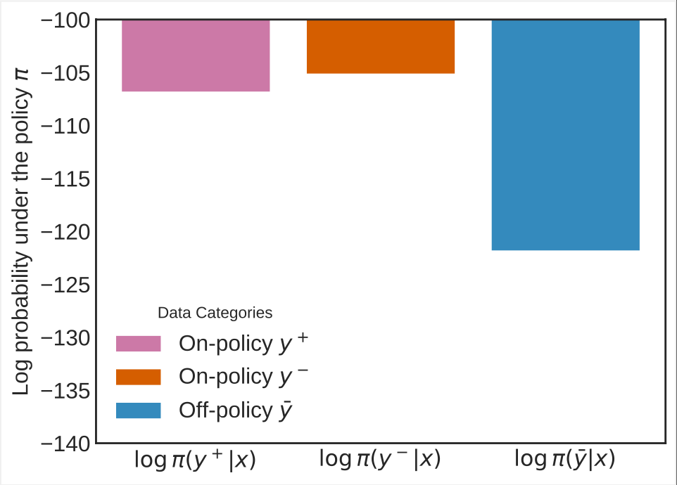

偏好数据集收集中分布偏移问题的说明。

*   在线学习：如果可以在训练过程中查询偏好预言机 $\mathcal{P}(x,a^1,a^2)$ 或其近似器 $\hat{\mathcal{P}}(x,a^1,a^2)$ ，那么 $\pi_t$ 的学习就是在线的。根据查询（近似）偏好预言机的频率，在线学习算法可以进一步分类如下。
    *   顺序/完全/逐批在线：对于每批，都会查询 $\mathcal{P}(x,a^1,a^2)$ 或 $\hat{\mathcal{P}}(x,a^1,a^2)$ 。
    *   迭代在线：每 $T$ 批查询一次 $\mathcal{P}(x,a^1,a^2)$ 或 $\hat{\mathcal{P}}(x,a^1,a^2)$ 。
    *   混合在线：从离线数据集（例如所有开源偏好数据集）开始，但在后续训练中包含在线探索。
*   离线学习： $\pi_t$ 的学习是离线的，如果 $\mathcal{P}(x,a^1,a^2)$ 或 $\hat{\mathcal{P}}(x,a^1,a^2)$ 只能在训练前进行查询。

在实践中，上述两个维度（开/关策略和开/离线）通常并非正交的。因此，我们按照上述定义的类别展示了几种对齐方法，以进一步阐明这些概念。

1. PPO 与固定奖励模型：策略内但离线（从 $\pi_t$ 采样响应→策略内，固定奖励模型→离线）
2. PPO 为每个 $\pi_t$ 配备单独的奖励模型：策略内和在线（因为通过查询 $\mathcal{P}(x,a^1,a^2)$ 或 $\hat{\mathcal{P}}(x,a^1,a^2)$ 以从 $\pi_t$ 标记样本来训练新的奖励模型）。
3. （香草）在固定且预先收集的数据集上的 DPO：非策略性和离线（从其他 LLM 预先收集的响应 → 非策略性，偏好是预先标注且固定的 → 离线）
4. 迭代拒绝采样微调与固定奖励模型：策略内但离线（与案例 1 相同）。
5. 迭代式在线 RLHF：策略内和迭代式在线（如其名称所示）。
6. 迭代 DPO：策略内和迭代在线（如其名称所示）。
7. 在线数据保护官：符合政策且（完全）在线（因为每批都查询 $\hat{\mathcal{P}}(x,a^1,a^2)$ ）

⚠️所有使用一次性训练的奖励模型的方法：离线进行，因为奖励模型会对响应进行评分，并且该模型在训练过程中不会查询 $\mathcal{P}(x,a^1,a^2)$ 或 $\hat{\mathcal{P}}(x,a^1,a^2)$ 。

⚠️所有偏离策略的方法（到目前为止）都意味着离线学习：给定一个正在训练的策略，我们总是可以生成符合策略的响应，所以当我们可以访问 $\mathcal{P}(x,a^1,a^2)$ 或 $\hat{\mathcal{P}}(x,a^1,a^2)$ 但不使用它们来标注对符合策略的响应的偏好时，这是没有意义的。

* * *

2 RLHF：使 ChatGPT 得以实现的经典框架
==========================

2.1 指导 - GPT：一种三阶段方法
--------------------

最标准的 RLHF 框架于 2017 年首次推广，并在随后的应用中取得了巨大成功，如 Instruct-GPT 和 Claude。Instruct-GPT 中提出的经典框架包括三个步骤：

步骤 1 偏好数据收集：使用行为策略对 $\pi_1, \pi_2$ 收集比较数据集 $\mathcal{D}$

$$
x \sim d_0, (a^1,a^2) \sim (\pi^1,\pi^2), \qquad y \sim \mathrm{Bernoulli} \big(\mathcal{P}(x,a^1,a^2)\big).
$$

第 2 步 奖励建模：将奖励函数训练为 Bradley-Terry 模型的最大似然估计（MLE）。

$$
\ell_{\mathcal{D}}(\theta) = \sum_{(x,a^1,a^2,y) \in \mathcal{D}} \log \Big(\sigma\big(r_{\theta}(x,a^1) - r_{\theta}(x,a^2)\big)\Big).
$$

第 3 步 策略优化：使用带有正则化奖励的 PPO 来优化策略：

$$
\pi_r(a|x) := \arg\max_{\pi}\left[ r(x,a) - \eta \log \frac{\pi(a|x)}{\pi_0(a|x)}\right]
$$

**离线和在线 RLHF，与 RL 文献有所不同的术语**

该框架被称为离线框架，因为我们在此过程中不会进一步查询神谕 $\mathcal{P}(\cdot)$ 。换句话说，离线算法和在线算法的关键区别在于我们是否在此过程中查询偏好神谕 $\mathcal{P}(\cdot)$ ，而不是生成新的响应。从这个意义上说，具有固定奖励模型的 PPO 是一种离线算法。

通常，行为策略恰好是 $\pi_0$ 。然后，构建的奖励模型 $r$ 能够准确地评估来自 $\pi_0$ 的生成。我们可能期望奖励模型 $r$ 在 PPO 训练过程中面对分布变化时，能够很好地泛化到超出 $\pi_0$ 的分布范围之外。不幸的是，正如在“奖励模型过度优化的缩放定律”中所展示的那样，一般情况下并非如此。

在这里，Gold 奖励 $r^*$ （实线）是一个 7B 奖励模型，被设置为 $\mathcal{P}$ 来标注数据。代理 - RM $r$ （虚线）是从由 $\pi_0$ 收集并由 $r^*$ 标注的离线数据集训练的奖励模型。正如我们所看到的，在初始阶段，代理奖励和 Gold 奖励都增加，这意味着代理奖励 $r$ 是准确的，并且与 Gold 奖励很好地对齐。然而，随着 KL 散度增加，意味着分布偏移变得严重，代理奖励持续增加，但 Gold 奖励下降。

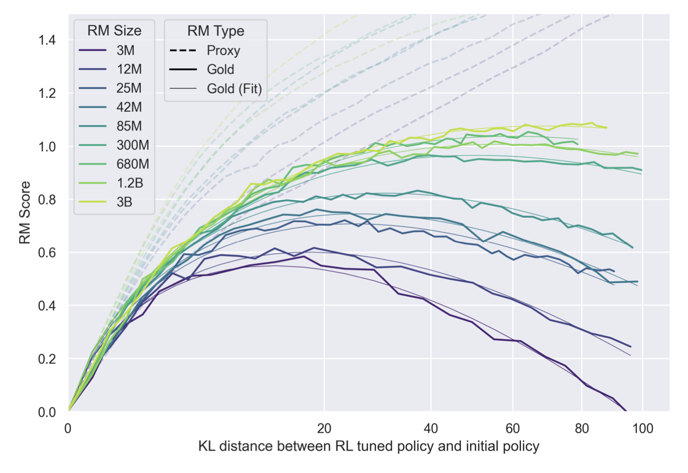

在大多数现有文献中，RLHF 算法很容易远离初始模型，以至于 KL 散度大于 $20$ ，这意味着在偏好学习的过程中存在显著的分布偏移：

$$
\left|\frac{\pi_t(\cdot|x)}{\pi_0(\cdot|x)}\right|_\infty \geq \exp\big(20).
$$

查看图 13 中的 PPO、图 4 中的 DPO 以及图 3 中的拒绝采样微调。

❗ 要点：离线 RLHF 存在分布偏移问题，奖励对分布外样本（尤其是高奖励样本）的泛化能力较差。因此，在设计 RL 算法以最大化这些训练后的奖励模型时，我们必须考虑到这一因素。

我们顺便提及，很自然地可以看出，奖励模型可能无法很好地泛化，因为奖励模型是从一些基础预训练模型进行微调的，并且“微调通常会提高分布内的泛化能力，但在分布外往往表现不佳，有时甚至相对于零样本提示会降低性能”。

2.2 在线迭代式强化学习人类反馈（注：RLHF 为 Reinforcement Learning from Human Feedback 的缩写）
--------------------------------------------------------------------------

我们借助 Claude 项目来说明在线迭代式 RLHF，因为与 Instruct-GPT 相比，它包含更多细节。从无到有，其过程如下：

*   第 1 步政策培训：我们使用所有历史数据来训练我们所能训练的最佳 RLHF 政策；
*   第 2 步数据收集：我们使用获得的策略来收集新的比较响应，并要求人类对其进行标注；然后，新的比较数据与所有历史数据混合在一起；
*   第 3 步奖励建模和策略优化：然后，我们根据新的数据混合训练一个奖励，并训练一个新的 RLHF 策略。然后无限期地重复这个过程。

我们注意到，该框架（及其变体）也被 Instruct-GPT 和 LLaMA2 项目所采用。这里，术语“迭代”强调了训练成本和神谕查询频率之间的权衡，与所有信号都由人类提供的完全在线设置相比。有可能当人类数据以高频率收集时，KL 正则化不太重要。相反，在与人类进行稀疏更新和迭代时，施加足够的正则化是至关重要的。例如，由于 Instruct-GPT 的大部分数据是从 $\pi_0$ 采样的，有些来自中间检查点，Instruct-GPT 项目进一步采用了与预训练数据分布的重放损失，并发现最优 KL 系数约为 $0.02$ 。另一方面，Claude 项目似乎与人类的交互更加频繁，使用的 KL 系数要小得多，为 $0.001$ 。

我们总结了一些重要方面如下。

*   动机：采用这种在线框架的主要动机是，在线 RLHF 策略有助于收集奖励分布高端的数据，而这些数据很难从 $\pi_0$ 中采样。然后，新数据有助于改进对高奖励机制样本的奖励估计，从而使我们能够训练出更好的策略。
*   由于 RLHF 策略往往会失去输出的多样性，因此在步骤 2 中纳入某种探索策略以提高通过在线过程收集的数据的多样性至关重要。
*   混合变体 LLaMA2 在其初始数据混合中包含开源离线偏好数据集，并在整个在线 RLHF 过程中保留它们：它们可以使奖励模型具有更好的泛化能力，并防止奖励作弊。
*   训练重启：Claude 在训练每个新的 RLHF 策略时，从 $\pi_0$ 开始重新训练，而不是对同一模型进行迭代训练。目前尚不清楚 Instruct-GPT 和 LLaMA2 是否采用相同策略。请注意，我们在每次迭代中使用所有历史数据。在这种情况下，从 $\pi_0$ 开始重新训练可能有助于缓解过度优化和奖励作弊，同时不会降低模型性能。

克劳德和 LLaMA2 框架的总结与比较。

<table data-immersive-translate-walked="bb3e1e60-8177-4a45-950f-013d9370f6ba"><thead data-immersive-translate-walked="bb3e1e60-8177-4a45-950f-013d9370f6ba"><tr data-immersive-translate-walked="bb3e1e60-8177-4a45-950f-013d9370f6ba"><th data-immersive-translate-walked="bb3e1e60-8177-4a45-950f-013d9370f6ba"></th><th data-immersive-translate-walked="bb3e1e60-8177-4a45-950f-013d9370f6ba" data-immersive-translate-paragraph="1"> 初始数据</th><th data-immersive-translate-walked="bb3e1e60-8177-4a45-950f-013d9370f6ba" data-immersive-translate-paragraph="1"> 第二步中的探索</th><th data-immersive-translate-walked="bb3e1e60-8177-4a45-950f-013d9370f6ba" data-immersive-translate-paragraph="1"> 奖励优化</th></tr></thead><tbody data-immersive-translate-walked="bb3e1e60-8177-4a45-950f-013d9370f6ba"><tr data-immersive-translate-walked="bb3e1e60-8177-4a45-950f-013d9370f6ba"><td data-immersive-translate-walked="bb3e1e60-8177-4a45-950f-013d9370f6ba"><a href="https://arxiv.org/abs/2204.05862" data-immersive-translate-walked="bb3e1e60-8177-4a45-950f-013d9370f6ba">https://arxiv.org/abs/2204.05862</a></td><td data-immersive-translate-walked="bb3e1e60-8177-4a45-950f-013d9370f6ba" data-immersive-translate-paragraph="1"> <mjx-container data-immersive-translate-walked="bb3e1e60-8177-4a45-950f-013d9370f6ba" style="font-size: 116.9%; position: relative;" imt-original-formula="\pi_0" ctxtmenu_counter="141" tabindex="0" jax="CHTML" class="MathJax CtxtMenu_Attached_0 notranslate imtOriginalFormula142"><mjx-math aria-hidden="true" class="MJX-TEX"><mjx-msub><mjx-mi class="mjx-i"><mjx-c class="mjx-c1D70B TEX-I"></mjx-c></mjx-mi><mjx-script style="vertical-align: -0.15em;"><mjx-mn size="s" class="mjx-n"><mjx-c class="mjx-c30"></mjx-c></mjx-mn></mjx-script></mjx-msub></mjx-math><mjx-assistive-mml display="inline" unselectable="on"><math xmlns="http://www.w3.org/1998/Math/MathML"><msub><mi>π</mi><mn>0</mn></msub></math></mjx-assistive-mml></mjx-container> 和拒绝采样</td><td data-immersive-translate-walked="bb3e1e60-8177-4a45-950f-013d9370f6ba" data-immersive-translate-paragraph="1"> 在不同训练步骤和迭代中保存的模型</td><td>PPO</td></tr><tr data-immersive-translate-walked="bb3e1e60-8177-4a45-950f-013d9370f6ba"><td data-immersive-translate-walked="bb3e1e60-8177-4a45-950f-013d9370f6ba"><a href="https://arxiv.org/abs/2307.09288" data-immersive-translate-walked="bb3e1e60-8177-4a45-950f-013d9370f6ba">https://arxiv.org/abs/2307.09288</a></td><td data-immersive-translate-walked="bb3e1e60-8177-4a45-950f-013d9370f6ba" data-immersive-translate-paragraph="1"> <mjx-container data-immersive-translate-walked="bb3e1e60-8177-4a45-950f-013d9370f6ba" style="font-size: 116.9%; position: relative;" imt-original-formula="\pi_0" ctxtmenu_counter="142" tabindex="0" jax="CHTML" class="MathJax CtxtMenu_Attached_0 notranslate imtOriginalFormula143"><mjx-math aria-hidden="true" class="MJX-TEX"><mjx-msub><mjx-mi class="mjx-i"><mjx-c class="mjx-c1D70B TEX-I"></mjx-c></mjx-mi><mjx-script style="vertical-align: -0.15em;"><mjx-mn size="s" class="mjx-n"><mjx-c class="mjx-c30"></mjx-c></mjx-mn></mjx-script></mjx-msub></mjx-math><mjx-assistive-mml display="inline" unselectable="on"><math xmlns="http://www.w3.org/1998/Math/MathML"><msub><mi>π</mi><mn>0</mn></msub></math></mjx-assistive-mml></mjx-container> 和离线开源数据</td><td data-immersive-translate-walked="bb3e1e60-8177-4a45-950f-013d9370f6ba" data-immersive-translate-paragraph="1"> 不同的模型变体，具有不同的采样温度。</td><td data-immersive-translate-walked="bb3e1e60-8177-4a45-950f-013d9370f6ba" data-immersive-translate-paragraph="1"> 拒绝采样微调 + PPO</td></tr><tr data-immersive-translate-walked="bb3e1e60-8177-4a45-950f-013d9370f6ba"><td data-immersive-translate-walked="bb3e1e60-8177-4a45-950f-013d9370f6ba" data-immersive-translate-paragraph="1"> 迭代式直接政策优化（注：这是一种可能的翻译，具体含义可能需要根据上下文来确定）</td><td>-</td><td data-immersive-translate-walked="bb3e1e60-8177-4a45-950f-013d9370f6ba" data-immersive-translate-paragraph="1"> 拒绝采样：n 个中的最佳与 n 个中的最差。</td><td data-immersive-translate-walked="bb3e1e60-8177-4a45-950f-013d9370f6ba" data-immersive-translate-paragraph="1"> DPO（见下一节）</td></tr></tbody></table>

* * *

3 个无 RL 框架：SLiC、DPO、IPO 及更多
===========================

虽然基于深度强化学习（DRL）的（近端策略优化（PPO））强化学习人类反馈（RLHF）框架在 Chat-GPT 中取得了巨大的成功，但 RLHF 中的强化学习步骤是内存密集型的，因为它需要同时加载 4 个模型：

*   “LLM政策需进行调整，即 PPO 中的行动者；”
*   奖励模型
*   在 PPO 中的评论家，其通常被初始化为奖励模型；
*   用于计算 KL 的参考模型

更重要的是，由于训练稳定性问题和样本效率问题，将 PPO 调整到最佳性能具有挑战性。到目前为止，强大的闭源LLMs的成功尚未得到广泛重现。鉴于此，研究人员努力设计更稳定和高效的算法作为 PPO 的替代方法，尤其关注无强化学习（RL-free）算法。

3.1 直接偏好优化（DPO）和在线变体
--------------------

我们要介绍的第一个无强化学习对齐算法自然遵循强化学习人类反馈（RLHF）框架，即 Rafailov 等人（2023 年）提出的 DPO 算法。DPO 的关键灵感是 RLHF 中强化学习步骤的闭式解，因此是 RLHF 目标的最优策略的等效解。

### 基于强化学习从人类反馈中推导 DPO 目标函数

让我们从 DPO 目标如何从 RLHF 框架中推导出来开始。RLHF 的解决方案与 DPO 目标之间的等价性依赖于以下两个命题。

命题 1 对于任何奖励函数 $r$ ，KL 约束优化具有以下封闭形式的解决方案： 
$$
\pi^*_r(a|x):=\arg \max_{\pi} \mathbb{E}_{x \sim d_0} \left[ \mathbb{E}_{a \sim \pi(\cdot|x)}[r(x,a)] - \eta \mathrm{KL}(\pi(\cdot|x)\Vert \pi_0(\cdot|x)) \right] = \frac{1}{Z(x)} \pi_0(a|x) \exp( \frac{1}{\eta}r(x,a)),
$$

其中 $Z(x)= \sum_{a'} \pi_0(a'|x) \exp( \frac{1}{\eta}r(x,a'))$ 是归一化常数，由于动作空间（所有可能的响应）在长度方面呈指数级增长，因此无法直接计算。利用这个命题，我们可以通过 $r \to \pi_r$ 将奖励与策略联系起来。特别是，对两边取对数，我们有

$$
r_\theta (x,a) = \eta \log \frac{\pi_\theta (a|x)}{\pi_0(a|x)} + \eta \log Z(x).
$$

关键的观察结果是，在布拉德利 - 特里模型的可能性中，我们关注奖励差异，而难以处理的 $Z(x)$ 会抵消掉！具体来说，将重新参数化的奖励插入到 BT 模型的可能性中，我们有以下 DPO 损失函数：

$$
\ell^{\text{DPO}}(\theta) = - \sum_{(x, a^+, a^-)} \log \sigma\left[\eta \log \frac{\pi_\theta({a}^+|x)}{\pi_0({a}^+|x)} - \eta \log \frac{\pi_\theta({a}^-|x)}{\pi_0({a}^-|x)}\right]
$$

所得算法称为直接偏好优化（DPO）。我们可以跳过奖励建模步骤，通过在给定的偏好三元组 $\{(x,a^+,a^-)\}$ 上最大化上述目标来直接优化策略。

⚠️请注意，原始的 DPO 工作是一种离线算法，依赖于偏好数据集的质量。在原始的 DPO 论文中，作者建议使用初始检查点来收集类似于 RLHF 的数据集。

命题 2：如果我们只考虑与 $\pi_0$ 具有相同支持的政策 $\pi$ ，那么 DPO 和 RLHF 的解决方案是相同的。

首先，我们想用几行来解释上述句子中“支持”的含义。它指的是给定LLM策略具有严格正概率的句子集合。从数学上讲，具有相同词汇的所有LLMs具有相同的支持，因为 $\text{softmax}$ 函数在每个时间步为所有标记分配 $>0$ 概率。实际上，情况并非如此，因为实数是以有限精度表示的。

现在，让我们考虑在 DPO 和 RLHF 下的最优策略之间的等价性。

对于给定的奖励函数 $r$ 和相应的最优策略 $\pi_r^{*}$ ，很容易看出，无论 $P$ 是否为 Bradley-Terry 模型，以下情况都成立：

$$
\mathbb{E}_{(x, a^1, a^2)}\left[P(a^1\succ a^2|x)\log\sigma\left(r(x,a^1) - r(x,a^2)\right)  \right] = \mathbb{E}_{(x, a^1, a^2)}\left[P(a^1\succ a^2|x)\log\sigma\left(\eta\log\left(\frac{\pi_r^*(a^1|x))}{\pi_{\text{ref}}(a^1|x)}\right) - \eta\log\left(\frac{\pi_r^*(a^2|x))}{\pi_{\text{ref}}(a^2|x)}\right)\right)  \right].
$$

上述内容表明，对于 $r$ 的 BT 奖励目标也是对于 $\pi_r^*$ 的 DPO 目标值。现在让我们考虑以下两种情况：

1. $r$ 对 Bradley-Terry 来说是最优的

$\pi_r^*$ 对于 RLHF 目标是最优的。假设 $\pi_r^*$ 对于 DPO 目标是次优的，那么一定存在另一个策略 $\pi'$ ，使得 $\pi'$ 获得严格更低的 DPO 损失。接下来的推论是存在另一个 $r'$ ，使得 $\pi'=\pi_{r'}^*$ 并且这个 $r'$ 获得比 $r$ 更低的 BT 损失，这与 $r$ 是最优的这一说法产生矛盾。
2. $\pi^*$ 对 DPO 来说是最优的

然后很容易看出，对于 BT 模型，相应的 $r\triangleq\eta\log\frac{\pi^*(a|x)}{\pi_{\text{ref}}(a|x)}$ 必须是最优的，因此对于 RLHF，相应的最优值则是 $\pi(a|x)\propto\pi_{\text{ref}}(a|x)\exp\left(\eta^{-1}\cdot\eta\cdot\log\frac{\pi^*(a|x)}{\pi_{\text{ref}}(a|x)}\right) = \pi^*(a|x)$ 。

因此，如命题 2 所述，DPO 和 RLHF 目标函数的解是相同的。顺便提一下，将成对排名扩展到 k 元排名是可能的。

### DPO 算法的图示

根据我们在第 1.3 节中给出的在线/离线学习的定义，DPO 算法可以以离线（也称为非策略）和在线（也称为策略）的方式实现。

1. 离线 DPO 由 Rafailov 等人（2023 年）提出

香草/离线直接策略优化（DPO）在给定的一组偏好数据 $\mathcal{D}=\{(x, a^+, a^-)\}$ 上直接优化 LLM 策略，其中的响应是从无法访问的 LLMs 中采样的，并且对它们的偏好是由人类（例如来自 Anthropic 的 `[HH](https://github.com/anthropics/hh-rlhf)` 数据集）或人工智能（例如来自清华大学的 `[UltraChat](https://github.com/thunlp/UltraChat)` 数据集）标注的。

这种离线数据处理操作的过程可以被描述为：

$$
\begin{aligned}
    \text{for}~&~(x,a^+,a^-)~~\text{in}~~\mathcal{D}: \\
    &~\text{update}~\theta_{t}~\text{by~loss}~\ell^{\text{DPO}}(\theta_t) \triangleq\log \sigma\left[\eta \log \frac{\pi_\theta({a}^+|x)}{\pi_0({a}^+|x)} - \eta \log \frac{\pi_\theta({a}^-|x)}{\pi_0({a}^-|x)}\right] \\
    &~t=t+1
    \end{aligned}
$$

与 RLHF 相比，上述离线 DPO 目标函数会导致更稳定的学习以及更轻松的超参数调整。
2. 在线数据保护官（Online Data Protection Officer），郭等人（2024 年）

尽管离线 DPO 具有优势，但正如我们之前所说明的，它存在从 $\mathcal{D}$ 到 $\pi_{\theta^t}$ （正在训练的策略）的显著分布偏移。同时，DPO 目标函数的推导也需要策略内样本。因此，Guo 等人（2024 年）提出了 DPO 的在线版本以避免偏移问题，其大纲如下：

$$
\begin{aligned}
    \text{for}~&\textcolor{red}{x}~\text{in}~~\mathcal{D}: \\
    &\text{sample two responses} a^1, a^2\sim \pi_{\theta^t}(\cdot|x) \\
    &\text{annotate them by either human or AI lablers to get}~a^+, a^- \\
    &\text{update}~\theta_{t}~\text{by~loss}~\ell^{\text{DPO}}(\theta_t) \triangleq\log \sigma\left[\eta \log \frac{\pi_\theta({a}^+|x)}{\pi_0({a}^+|x)} - \eta \log \frac{\pi_\theta({a}^-|x)}{\pi_0({a}^-|x)}\right] \\
    &~t=t+1
    \end{aligned}
$$

在离线 DPO 中，所有响应一次性进行采样和标注，从正在训练的策略中进行采样的频率在训练期间为 0。另一方面，在在线 DPO 中，所有响应以批量方式进行采样，采样频率为 1/批。
3. Iterative DPO （该内容为专业术语或特定名称，在这种情况下，保留原文）

除了这两种极端情况之外，熊等人（2023 年）和徐等人（2023 年）同时提出的迭代 DPO 是它们之间的一种自然权衡，其中每批的采样频率在 0 到 1 之间。其过程可描述为：

$$
\begin{aligned}&\text{Initialize } \mathcal{D} = \mathcal{D}_{\mathrm{off}};\\ & \text{for t = 1,2,3,...}\\ &\qquad \text{train } \pi_t \text{ from } \pi_0 \text{ using DPO } \text{and  with } \mathcal{D};\\ &\qquad \text{use two exploration policies } (\tilde{\pi}_t^1, \tilde{\pi}_t^2) \text{ to collect m response pairs};\\&\qquad \text{ask human or AI labeler to label the preference signal to get }\mathcal{D}_t;\\&\qquad \mathcal{D} \leftarrow \mathcal{D} \cup \mathcal{D}_t \end{aligned}
$$

与在线版本相比，迭代版本可被视为在采样频率和训练效率之间的一种权衡。另一个显著特征是作者强调了探索的重要性，这体现在他们对探索策略 $(\tilde{\pi}_t^1, \tilde{\pi}_t^2)$ 的选择中。探索策略的最优选择取决于顺序决策中的不确定性，而这在实践中可能不容易计算（在此处查看理论解释）。然而，理论见解至少应该在原则上推动算法设计：

*   熊等人（2023 年）证明，当离线数据集足够多样化时（多样性与质量并不完全相同）， $(\pi_0, \pi_t)$ 是足够的；
*   否则，我们可能会选择围绕 $\pi_t$ 的策略，以利用到目前为止收集的数据背后的信息，但同时，最大限度地扩大它们的差异，以促进探索。
    *   LLaMA2 和 Claude 选择在不同的训练步骤中使用不同的模型变体以及不同的温度；
    *   徐等人（2023 年）和 Snorker-AI-DPO 提议使用拒绝采样：我们为每个提示独立采样 4 个响应，让神谕对它们进行排名，并取最好的与最差的进行比较。

探索政策的设计在很大程度上仍未得到充分探索，只有一些初步工作。还有一系列工作考虑主动学习。有关不同探索政策选择及其背后的理论见解的讨论，请参见本小节。

### 关于离线 DPO 中现今未被充分理解的一些内容

一些研究小组观察到，在离线 DPO 训练过程中， $\log \pi(a^+|x)$ 和 $\log\pi(a^-|x)$ 都有所减少。下面，我们展示官方 DPO 实现的 Wandb 日志。

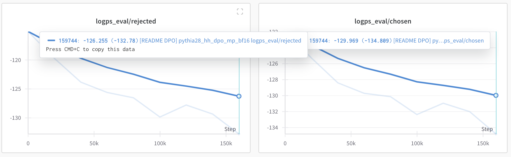

上述图表中政策的行为是违反直觉的：在 DPO 训练后，以 $x$ 为条件， $**a^+$ 的概率低于 $a^-$ 。这种奇怪的现象自 2023 年 8 月以来就已被观察到，但到目前为止还没有合理的解释。同时，在线 DPO 是否存在同样的问题尚不清楚。

我们的猜测是，对于模型来说，降低 $\pi(a^+|x)$ 和 $\pi(a^-|x)$ 可能更容易，因为它们在 $\pi(\cdot|x)$ 下的可能性太低。假设这是真的，那么在线 DPO 应该增加 $\pi(a^+|x)$ 并降低 $\pi(a^-|x)$ ，因为它们都来自 $\pi(\cdot|x)$ 的模式。但是，我们没有进行任何实验来验证它，所以我们想把这仅仅作为一个假设。如果您想深入研究这个问题，请随时与我们联系！我们对这个问题的答案非常感兴趣！

**DPO 及其他对齐算法的冗长性偏差**

与 SFT 模型相比，与 DPO 对齐的模型往往会生成长得多的响应，并且即使奖励模型并未明确偏向更长的响应，在迭代过程中这种偏差也会进一步放大。作为案例研究，我们使用奖励模型 weqweasdas/RM-Mistral-7B 来标记响应，并使用 SFT 检查点 HuggingFaceH4/mistral-7b-sft-beta。然后，我们观察到通过（迭代）DPO 和 RAFT 对齐得到的模型比 SFT 模型的长度长两倍以上。另一方面，我们为每个提示计算皮尔逊相关系数，根据平均响应长度对提示进行分组，并绘制如下热图。

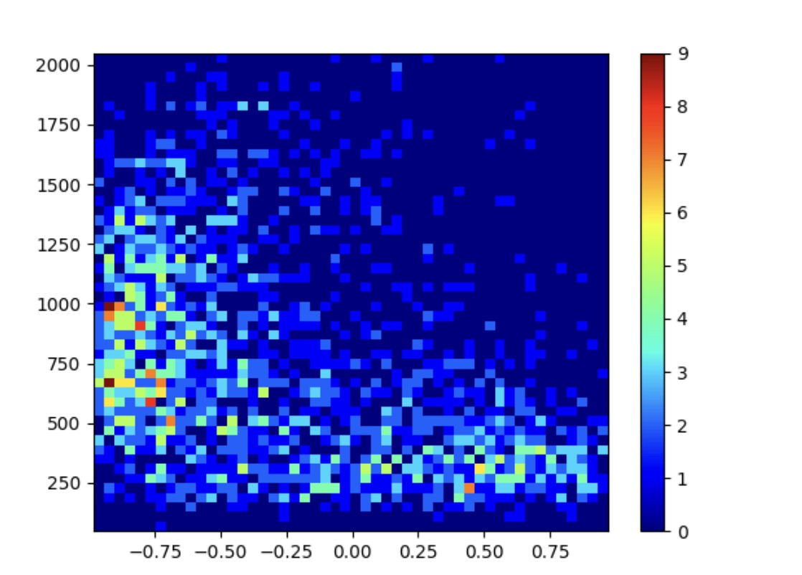

x：响应长度与奖励之间的每个提示的皮尔逊相关系数；y：提示的数量的热图。

在某种程度上，奖励模型可能倾向于较短的响应，或者至少没有明确倾向于较长的响应。然而，与 SFT 模型相比，所得模型生成的响应要长得多。这也与 DPO 训练中似然性降低的观察结果有关。我们如下绘制训练集上的密度比 $\pi_t(\cdot|x)/\pi_t(\cdot|x)$ 。

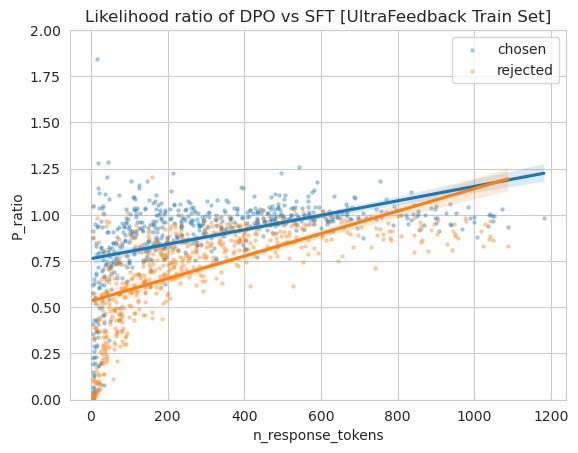

DPO 对齐模型（HuggingFaceH4/zephyr - 7b - beta）与 SFT 模型之间的密度比（1000 对）

正如我们所见，所选回答和被拒绝回答的平均可能性都有所降低，但简短回答对这一现象的影响最大。另一方面，长回答在可能性方面要稳定得多。

因此，冗长问题可能更多地与算法设计有关。我们猜测，与其试图消除数据或奖励中的长度偏差，我们可能需要在算法设计中明确处理这个问题，或者修改偏好信号，以在质量相似的情况下鼓励简短的回应。

3.2 身份偏好优化（IPO）
---------------

DPO 目标的一个显著局限性在于，它仍然假定 BT 模型用逐点奖励来替代成对偏好。为了解决这一局限性，Azar 等人（2023 年）随后引入了 $\Phi$ -偏好优化（ $\Phi\text{PO}$ ）。 （注：原文中 $\Phi$和 $\Phi\text{PO}$ 的含义不明确，所以在翻译中保留了原文符号）

**$\Phi$ -映射与 BT 模型之间的连接**

阿扎尔等人（2023 年）将 $\Phi$ 定义为一个从 $[0,1]$ 到 $\mathbb{R}$ 的一般非递减函数。因此，BT 模型实际上是它的一个特殊情况，可以定义为 $\Phi(P) = \log\frac{P}{1-P}$ 。如果您有兴趣了解为什么会这样，请查看他们的论文。

**BT 模型的问题（特别是在 DPO 中）**

下面，我们绘制函数 $f(P)=\log\frac{P}{1-P}$ 的曲线。可以看出，使用 BT 模型，当 $P(a^+ \succ a^- | x)=1$ 时，我们有 $f(P) = r(x, a^+) - r(x, a^-) \rightarrow +\infty$ ，因此 $\frac{\pi^*(a^-|x)}{\pi^*(a^+|x)}=0$ ，尽管正则化很强。正如 Azar 等人（2023 年）所声称的那样，这个问题在 RLHF 中不太显著，因为奖励模型通常在偏好数据集上欠拟合，因此 RLHF 产生的最终策略对参考策略进行了充分的正则化。然而，由于 DPO 没有训练奖励模型，因此来自欠拟合奖励模型的正则化就丢失了。

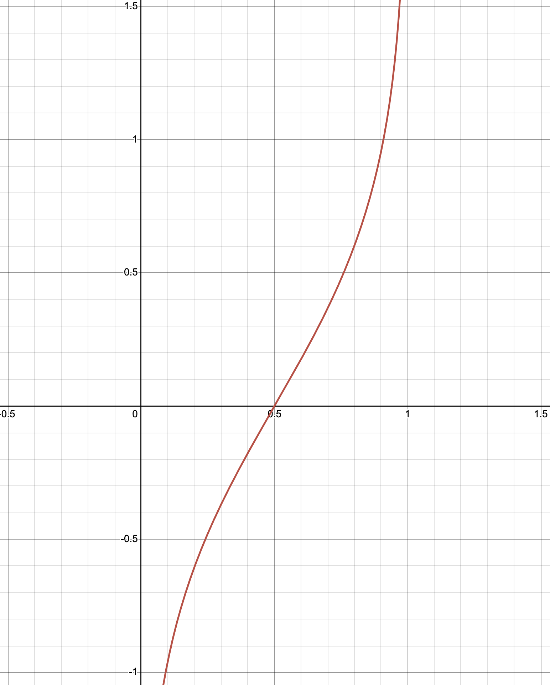

**首次公开募股：具有身份映射的偏好优化**

从 IPO 论文中针对上述问题的解决方案简单明了：将 BT 模型的 $\Phi(P) = \log\frac{P}{1-P}$ 映射函数替换为恒等映射函数 $\Phi(P)=P$ 。

我们在此略过经验首次公开募股损失函数的冗长推导，仅根据我们的符号将其写下：

$$
\ell^{\text{IPO}}(\theta)=\sum_{(x,a^+,a^-)}\left[\log\left[\frac{\pi_{\theta}(a^+|x)\pi_{0}(a^-|x)}{\pi_{\theta}(a^-|x)\pi_{0}(a^+|x)}\right] - \frac{1}{2\eta}\right]^2
$$

3.3 序列似然校准（SLiC）
----------------

与 DPO 和 IPO 目标不同，SLiC 的核心思想是校准从正在训练的策略中采样的排名序列的可能性。在人类偏好数据上，实现 SLiC 损失函数的一种方法如下所示：

$$
\ell^{\text{SLiC}}(\theta)=\sum_{x,a^+,a^-}\max\left[0, \delta-\log\pi_\theta(a^+|x)+\log\pi_\theta(a^-|x)\right] - \eta\cdot\log\pi_\theta(a_{\text{ref}}|x).
$$

直观地，上述 SLiC 损失函数可分解为两部分：

1. 排名函数：这是为了确保在当前政策 $\pi_\theta$ 下， $\log\pi_\theta(a^+|x)$ 和 $\log\pi_\theta(a^-|x)$ 之间的差异大于 $\delta$ 。
2. 交叉熵正则化器：SLiC 损失的第二部分是通过降低 $a_{\text{ref}}$ 的负对数似然（NLL）来鼓励模型接近 SFT 模型 $\pi_0$ 。在这部分中不存在 $\pi_0$ ，因为 $a_{\text{ref}}$ 可以从 $\pi_0$ 中采样。

赵等人（2023 年）在他们的论文中还讨论了排名函数和正则化器的其他可能选择。如果您对更多细节感兴趣，可以查看他们的论文。

3.4 DPO、IPO 与 SLiC 之间的比较
------------------------

在阅读完上述有关 DPO、IPO 和 SLiC 的内容后，一个自然的问题可能是：这三种算法中哪一种表现最佳？在我们讨论它们的经验表现之前，我们可以看到它们可以被视为不同的损失函数选择：如果我们表示为 $\rho_\theta = \log \frac{\pi_\theta(a^+|x)}{\pi_0(a^+|x)} - \log \frac{\pi_\theta(a^-|x)}{\pi_0(a^-|x)}$ ，那么

](loss-table.png)

来自广义偏好优化的表格：一种离线对齐的统一方法

郭等人（2024 年）将不同算法与其在线变体进行了比较，使用相同的在线人工智能标注员来标注偏好，由人类评估者评估的结果如下。

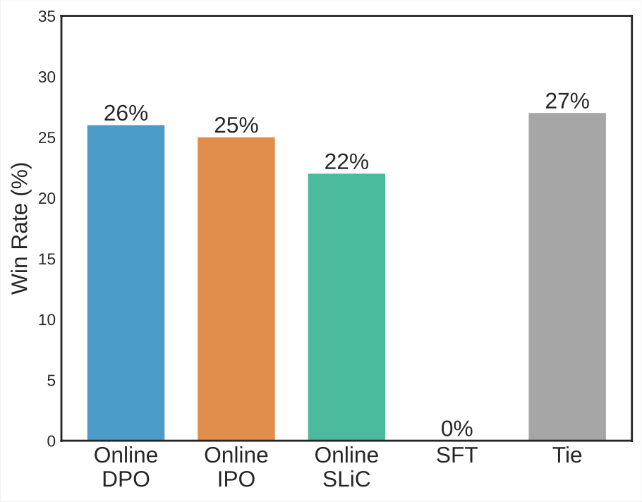

可以看出，在 26%/25%/22%的时间里，人们更倾向于使用在线 DPO/IPO/SLiC 的输出结果，而它们在大约 27%的时间里结果相同。这些结果基本证实了所有这些算法的在线版本的性能之间没有显著差异。

一个类似的实验已经由 Huggingface H4 团队以离线方式进行，他们的结果（如下所示）表明，对于大多数贝塔（在本博客中为艾塔）值，离线 IPO 的表现优于离线 DPO 和尚未介绍的离线 KTO。

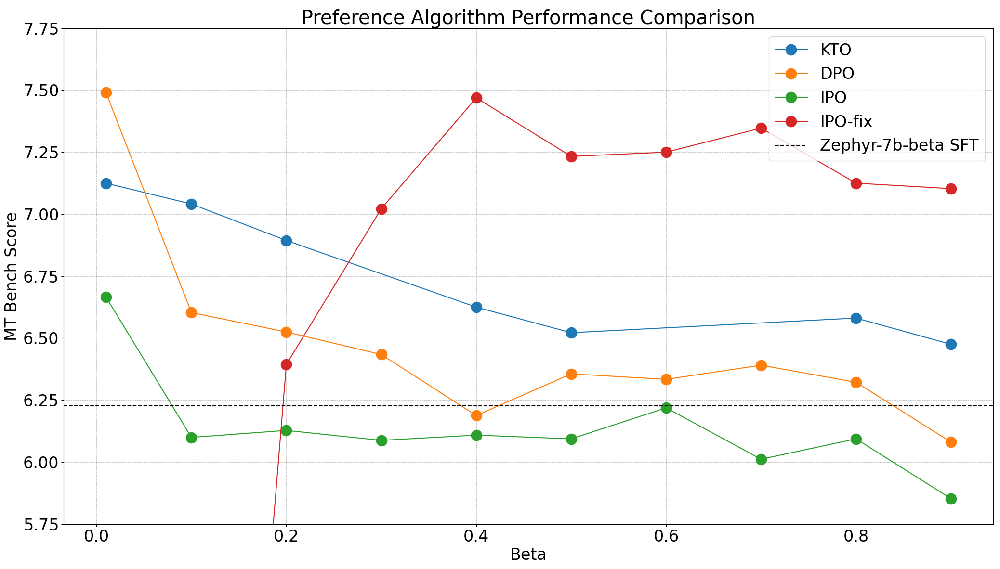

3.5 在 RLHF 中的拒绝采样
-----------------

拒绝采样是蒙特卡洛任务中广泛使用的一种方法，旨在通过从提议分布 $p$ 中采样来近似目标分布 $q$ 。此过程的效率主要取决于密度比

$$
\sup_x \frac{q(x)}{p(x)} \leq M.
$$

我们首先从提议分布 $p$ 中抽取 $n$ 个样本，其中每个样本以概率 $r = \frac{q(x)}{Mp(x)}$ 被接受。然后，被接受的样本 $\tilde{x}$ 代表目标分布 $q$ 。例如， $q$ 可能是针对某些学习奖励的 $\pi_r$ ，而 $p$ 可以是 $\pi_0$ 。在这种情况下，

$$
M = \sup_{x,a}\frac{\pi_0(a|x) \exp(r(x,a)/\eta)/Z(x)}{\pi_0(a|x)} = \sup_{x,a}\frac{1}{Z(x)} \exp(\frac{1}{\eta} r(x,a)).
$$

在拒绝采样中，主要挑战是由于一个大的 $M$ 导致其接受率低。在实践中，我们通常使用固定的 $n$ 预算，并且将接受的样本数量设置为超参数，从而导致在近似误差和样本效率之间进行权衡。在 RLHF 中使用拒绝采样有三种主要方式。

*   推理时间对齐：在这种情况下，对于每个查询提示 $x$ ，我们简单地采样 $n$ 个响应，并将奖励最高的那个作为最终输出（并拒绝所有其他样本）。它也被称为最佳的 $n$ 策略；
*   拒绝采样微调：我们更进一步，以迭代的方式对拒绝采样样本上的LLM进行微调。
*   作为一种探索策略的拒绝采样（RS）：最近，拒绝采样也被用于收集成对比较的样本。例如，Liu 等人提议使用拒绝采样为离线 DPO 训练生成样本，而一系列工作在迭代 DPO 训练中使用最佳 n 策略和最差 n 策略来构建比较响应。

广泛证实，对于包括训练一个有用的助手、机器翻译、数学推理、多轮自然语言游戏、编码在内的LLMs，简单的拒绝采样微调方法通常能达到与强化学习方法相当或更好的性能。因此，拒绝采样微调或简单的最佳 n 推断应作为 RLHF 算法设计的一个稳定基线。

另一方面，正如我们之前所讨论的，事实证明，拒绝采样作为一种启发式探索策略，对在线学习也很有帮助。

* * *

4 杂项
====

在本节中，我们将介绍几个涵盖基于强化学习和非强化学习的对齐算法的主题。我们没有找到非常有条理的方法来对这些主题进行分类，所以我们只是将它们全部归为关于对齐的杂项问题放在一起。

4.1 在 RLHF 中的奖励建模
-----------------

奖励模型大致可分为五组。

*   布拉德利 - 特里模型：使用成对比较的 BT 模型的最大似然估计，本质上是一个分类问题；
*   Direct preference optimization (DPO)：DPO 将 LLM 作为奖励进行训练，并且我们可以将 $\log \frac{\pi(a|x)}{\pi_0(a|x)}$ 作为奖励；
*   偏好模型：一种偏好模型将一个提示和两个响应作为输入，并输出哪一个更好；
*   基于回归的模型：基于回归的模型将绝对值作为信号，直接进行回归以用于训练；
*   LLM 作为一名评判员：将对回应的评估制定为给 LLM 的一项指令跟随任务。

我们建议感兴趣的读者参考以下 GitHub 存储库，以获取训练最先进的奖励模型的方法。

[https://github.com/WeiXiongUST/RLHF-Reward-Modeling](https://github.com/WeiXiongUST/RLHF-Reward-Modeling)

### LLM - 作为一名法官 与 奖励模型：

从分布外泛化的角度来看

正如我们之前提到的，RLHF 存在分布偏移问题，奖励模型对分布外样本（尤其是高奖励样本）的泛化能力往往较差。因此，一个重要的信息是，奖励模型仅在局部是准确的。换句话说，准确性是一个相当有限的指标。评估奖励模型质量的另一个重要指标是面对分布偏移时的鲁棒性，这在之前很大程度上被忽略了。从图中我们确实知道的一件事是，较大的模型似乎能够容忍更多的分布偏移。

💡 如 Wang 等人（2024 年）所示，奖励分数的线性变换，例如 $\tilde{r}(x,y)=r(x,y)+C(x)$ 其中 $C(x):\mathcal{X}\mapsto\mathbb{R}$ ，不会改变 Bradley-Terry 模型的结果。

另一方面，LLMs 已知具有卓越的分布外泛化性能，因此它们可以缓解奖励模型的分布外问题。正如 Lee 等人（2023 年）所讨论的，与相同规模的奖励模型相比，LLMs 为 RLHF 产生更有效的奖励分数。同时，Guo 等人（2024 年）表明，与从LLMs获得奖励分数不同，LLMs 也为无 RL 方法产生有效的偏好。此外，他们还表明，来自较小的LLMs的反馈确实可以改善较大的LLMs的对齐，这为实现从弱到强的对齐开辟了一条与 OpenAI 不同的平行途径。

在最近发布的 RewardBench 中，第一作者还将 GPT - 4 与不同规模的 RMs 进行了比较，并指出了 GPT - 4 的优越性。第一作者的 X 帖中的结果如下所示。

<table data-immersive-translate-walked="bb3e1e60-8177-4a45-950f-013d9370f6ba"><thead data-immersive-translate-walked="bb3e1e60-8177-4a45-950f-013d9370f6ba"><tr data-immersive-translate-walked="bb3e1e60-8177-4a45-950f-013d9370f6ba"><th>Model</th><th data-immersive-translate-walked="bb3e1e60-8177-4a45-950f-013d9370f6ba" data-immersive-translate-paragraph="1"> 聊天</th><th data-immersive-translate-walked="bb3e1e60-8177-4a45-950f-013d9370f6ba" data-immersive-translate-paragraph="1"> 畅聊到底</th><th data-immersive-translate-walked="bb3e1e60-8177-4a45-950f-013d9370f6ba" data-immersive-translate-paragraph="1"> 安全</th><th data-immersive-translate-walked="bb3e1e60-8177-4a45-950f-013d9370f6ba" data-immersive-translate-paragraph="1"> 推理；推论；论证</th></tr></thead><tbody data-immersive-translate-walked="bb3e1e60-8177-4a45-950f-013d9370f6ba"><tr data-immersive-translate-walked="bb3e1e60-8177-4a45-950f-013d9370f6ba"><td data-immersive-translate-walked="bb3e1e60-8177-4a45-950f-013d9370f6ba" data-immersive-translate-paragraph="1">GPT-4 Turbo</td><td>95</td><td>74</td><td>87</td><td>87</td></tr><tr data-immersive-translate-walked="bb3e1e60-8177-4a45-950f-013d9370f6ba"><td data-immersive-translate-walked="bb3e1e60-8177-4a45-950f-013d9370f6ba" data-immersive-translate-paragraph="1"> 最佳 RM</td><td>97</td><td>59</td><td>90</td><td>90</td></tr></tbody></table>

### RM 与 KL 的缩放定律

由于奖励模型在分布外样本上的泛化能力较差，一个自然的问题是奖励模型对不同策略的泛化能力如何，其中差异可以通过 KL 散度来衡量。这就促使需要一种新的奖励模型缩放定律，其中 x 轴是奖励模型的大小，y 轴是它们最远的准确 KL 散度。奖励模型 $r$ 的最远准确 KL 散度被定义为正在训练的策略 $\pi$ 和参考策略 $\pi_{\text{ref}}$ 之间的最大 KL 散度，使得来自 $r$ 的分数的偏好的预期准确性高于给定阈值。由于人类标注者之间的一致程度通常为 70％，合理的阈值可以是 75％。

下面给出了上述所示缩放定律的示意图草图。

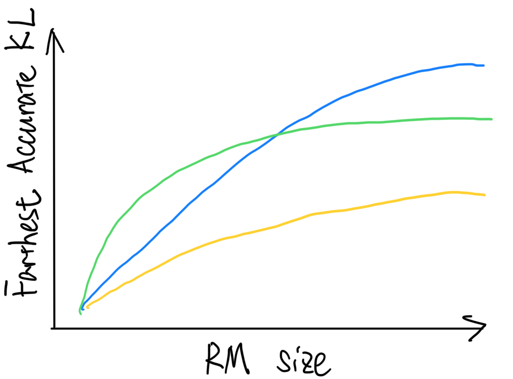

有了这样的缩放定律，我们可以很容易地判断在 RLHF 的 RL 训练中是否需要训练新的奖励模型，因为从 $\pi_t$ 到初始模型的 KL 散度可以很容易地跟踪。

4.2 在 RLHF 中的评估
---------------

由于分布偏移问题，奖励值是衡量对齐模型性能的一个不可靠指标。另一方面，人类偏好信号的收集成本高昂且速度缓慢。鉴于此，研究人员设计了各种基准来填补这一空白，其中一种常见的方法是使用强大的LLMs（如 GPT4、Claude）来近似人类。关注有用性（指令遵循能力）的流行基准包括

*   \*\*聊天机器人竞技场：\*\*
    *   人类向两个匿名模型提出任何问题；
    *   这些模型给出回应；
    *   人类确定获胜者。
*   MT 工作台是一组包含写作、角色扮演、提取、推理、数学、编码、知识 I（STEM）和知识 II（人文/社会科学）的多轮问题，每个类别包含 $10$ 个问题。
    *   GPT4 被用于在 \[1, 10\] 范围内给出一个绝对分数，以评估每个响应。

❗ 使用 GPT4 作为机器翻译基准评估器的一个实际问题是，LLMs 可能会引起不一致的评估。我们尝试将 GPT-4 切换为 Claude-3，发现这两个模型之间的一致性相当低。

*   羊驼评估：该模型被部署以与 GPT4-Turbo 竞争，其中 GPT4-Turbo 也被用于进行成对比较并报告胜率。该基准最初是为了衡量模型的指令遵循能力而设计的。

💡 按照与LLMs对齐的目标，我们在此强调，MT 基准和 Alpaca Eval 更关注LLMs的指令遵循能力，而不是LLMs的对齐行为。考虑到 Anthropic 在其 HH 论文中研究的“对齐成本”，对齐算法可能无法提高<10B LLMs在遵循用户指令方面的性能。因此，MT 基准和 Alpaca Eval 可能不完全适合对对齐进行全面评估。此外，对齐与指令遵循能力是正交的：一个强大的LLM可能非常有帮助，但同时可能很粗鲁，而一个弱小的LLM可能表现得友好，但不是那么有用。

其他目标的基准包括

*   PKU-SafeRLHF 以确保安全；
*   HELM 指令：具有绝对分数的多目标基准。

然而，众所周知，LLM存在以下限制：

*   评估提示集可能不足以代表真实世界的使用情况；
*   位置/冗长性/.. 偏向：LLM 可能倾向于更长的答案，而不论其质量如何，在成对比较中倾向于第一个答案，并倾向于包含列表的回答。还有李等人（2023 年）的一项工作为解决冗长偏向铺平了道路。查看宗杰的评论以了解更多详细信息！
*   自我增强偏差：LLM可能会偏爱他们自己的回答或来自类似模型的回答；
*   有限的推理能力：LLM在数学和推理问题上可能不足。

4.3 对 RLHF 的理论理解
----------------

偏好学习的理论理解可以追溯到决斗强盗模型，在该模型中，智能体从相对偏好反馈中学习，而不是像标准强盗模型或强化学习理论文献中那样从绝对奖励值中学习。从那时起，人们进行了广泛的研究，以了解在强盗模型或马尔可夫决策过程（MDP）场景中强化学习人类反馈（RLHF）的可学习性。然而，所有这些工作都只关注奖励最大化，并追求由奖励函数诱导的贪婪和确定性策略，从而偏离了实际应用。受实践的启发，RLHF 可以被表述为一个反向 KL 正则化的上下文强盗模型，与实际应用一致，适用于离线、在线和混合设置。在继续介绍理论框架和结果之前，我们首先假设以下计算预言机，它可以通过许多之前提到的实际算法（如 PPO、DPO、SLIC 和 IPO）进行合理近似。

计算神谕：对于任何给定的奖励 $r$ ，我们假定我们可以近似 $\pi_{r, \eta} := \mathcal{O}(r, \pi_0, \eta).$ （注：原文中 $r$ 和 $\pi_{r, \eta} := \mathcal{O}(r, \pi_0, \eta).$ 可能是特定的符号或代码，在没有更多上下文的情况下，无法进行准确翻译，所以保留原样）

Linear Reward Space: 我们假设 $r^*(x,a) = \phi(x,a)^\top \theta^*$ ，其中 $\phi: (x,a) \to R^d$ 是一个特征映射。 \*\*\*\* （注：原文中 $r^*(x,a) = \phi(x,a)^\top \theta^*$ 和 $\phi: (x,a) \to R^d$ 含义不明，按原文进行了翻译）

**离线学习与保守奖励是有效的：**

第一个设置是离线设置，在这种设置中，我们只能从离线数据集 $\mathcal{D} = \{(x_i, a_i^1, a_i^2, y_i)\}_{i=1}^n$ 中学习，而不能进一步查询 $\mathcal{P}$ 。如果我们采取以下策略：

$$
\hat{\pi} = \mathcal{O}\big(\underbrace{r_{\mathrm{MLE}} -c \cdot \sqrt{d}\|\phi(x,a) - \mathbb{E}_{x \sim d_0, a \sim \pi_0} \phi(x,a)\|_{\Sigma^{-1}_n}}_{\text{Lower confidence bound of } r^*}, \pi_0, \eta \big)
$$

高级理念是使用保守的奖励模型，因为奖励估计器始终是 $r^*$ \*\*的较低置信下界。\*\* 这里 $\Sigma^{-1}_n$ 表示在离线数据集上估计的协方差矩阵：

$$
\Sigma^{-1}_n = \lambda I + \sum_{(x,a^1,a^2) \in \mathcal{D}} \big(\phi(x,a^1)-\phi(x,a^2)\big)\big(\phi(x,a^1)-\phi(x,a^2)\big)^\top
$$

在这里， $\mathbb{E}_{x \sim d_0, a \sim \pi_0} \phi(x,a)$ 用作参考向量，因为由于偏好学习的性质，我们只能评估一对样本的不确定性。在实践中，我们应该使用从样本中估计的版本来代替预期的版本。

理想情况下，特征差异 $\big(\phi(x,a^1)-\phi(x,a^2)\big)$ 能够涵盖整个空间，这需要多样化的输出分布。然后，我们得到以下结果。

定理 1 ：大概率地，对于任何策略 $\pi$ ，我们有

$$
\eta \cdot \mathbb{E}_{x \sim d_0} \big[\mathrm{KL}(\pi(\cdot|x)\|\hat{\pi}(\cdot|x))\big] + J(\pi) - J(\hat{\pi}) \lesssim \sqrt{d} \mathbb{E}_{x \sim d_0, a \sim \pi} \|\phi(x,a) - \mathbb{E}_{x \sim d_0, a \sim \pi_0} \phi(x,a)\|_{\Sigma^{-1}_n}.
$$

当离线数据集（由 $\Sigma^{-1}_n$ 总结）为 $(\pi - \pi_0)$ 提供良好的覆盖时，KL 散度和值都会收敛。这在关于偏好数据集的以下覆盖假设中进行了总结：

$$
\mathbb{E}_{x \sim d_0, a \sim \pi} \|\phi(x,a) - \mathbb{E}_{a \sim \pi_0} \phi(x,a)\|_{\Sigma^{-1}_n} \leq \frac{1}{\sqrt{n}} C_{\mathrm{cov}}(\pi),
$$

其中 $C_{\mathrm{cov}}(\pi)$ 用于衡量偏好数据集对目标 $(\pi - \pi_0)$ 的覆盖程度，在有限样本的情况下，这可能与分布之间的密度比有关。

请注意， $\pi$ 可以是任意的，这意味着我们可能无法收敛到最优策略，但只要我们的数据集能够涵盖一些好的策略，我们就可以与之竞争。不幸的是，由于在实践中存在较大的分布偏移，我们可能无法期望离线数据集能够提供良好的覆盖范围（有关讨论，请参阅第 2.1 节）。这促使我们考虑以下在线迭代学习。

**偏好学习受益于在线探索：**

第二个设置是在线迭代设置，在训练过程中我们可以查询人类偏好预言机。我们专注于迭代设置，在该设置中，我们每隔 $m$ 步（批量大小）更新策略以进行稀疏更新。如果我们将探索策略视为

$$
(\tilde{\pi}_t^1, \tilde{\pi}_t^2)  = (\pi_t, \pi_0)
$$

然后，在第 3 节中介绍的迭代 DPO 具有以下理论保证。

定理 2 ：在批量大小为 $m$ 的情况下，经过至多 $T = \tilde{O}(d)$ 次迭代，很有可能我们可以找到一个好的策略，使得

$$
\eta \cdot \mathbb{E}_{x \sim d_0} \big[\mathrm{KL}(\pi^*(\cdot|x)\|\hat{\pi}(\cdot|x))\big] + J(\pi^*) - J(\hat{\pi})  \lesssim \sqrt{\frac{d}{\gamma^2m}} + \beta \|\mathbb{E}_{x \sim d_0} [\phi(x,\pi^*) - \phi(x, \pi_0) \|_{\Sigma^{-1}_{\textcolor{red}{\mathrm{off+online}}}}.
$$

更快的收敛速度：定理 1 和定理 2 的区别在于现在部分数据是从在线探索中收集的。在这种情况下，我们期望对于大多数平均实例，覆盖系数可以在很大程度上得到提高。这是因为，在覆盖目标中是特征差异。

$$
\phi(x, \pi^*) - \phi(x, \pi_0)
$$

并且在线数据由 $(\pi_t, \pi_0)$ 收集，假定离线数据集足够多样化，以便 $\pi_t\to \pi^*$ ，在线数据和覆盖目标之间的分布偏移逐渐变小，并且应该能够提供更好的覆盖系数 $C_{\mathrm{cov}}$ 。

同时，通过选择一个最优的 m，偏好预言机查询的总数 $mT=\tilde{O}(\frac{d^2}{\epsilon^2})$ 与顺序在线设置的总数 $m=1$ 相匹配，这意味着与顺序在线设置相比，具有大批次大小的在线迭代学习不会损害样本效率。

**在线探索策略的设计**

在线学习中的一个关键组成部分是设计有效的探索策略，以有效地探索提示 - 响应（状态 - 动作）空间。如果离线数据集无法提供足够的覆盖范围，或者我们研究从头开始学习，那么，我们必须采用一些探索策略。在这种情况下，我们可能仍然采取 $\pi_t^1 = \pi_t$ ，但要进行修改。

$$
\pi_t^2(\cdot|x) = \arg\max\|{\phi(x, \pi_t) - \phi(x,\pi_t^2)}\|_{\Sigma_{t,m}^{-1}}
$$

让我们直观地说明背后的见解：

*   第一个智能体利用收集到的样本，并选择目前为止的最佳猜测；
*   第二个智能体倾向于最大化其特征差异的不确定性，并提高在线过程中收集的数据的多样性，以促进探索。

虽然一般神经网络中的不确定性量化问题仍未解决，但我们的结果至少在原则上应该为实际算法提供依据和动力。例如，许多实际应用（Claude 和 LLaMA2）发现，使用当前模型的不同变体来收集新样本而不是仅使用一个模型至关重要，这样我们可以增加两种策略的特征差异，从而最大限度地提高不确定性。为了启发式地实现这一目标，一些常见的选择包括

*   使用通过从不同训练步骤中获取模型得到的 $\pi_t^1 = \pi_t$ 的变体；
*   使用不同的采样温度。
*   我们可以使用拒绝采样来近似这样一种探索原则，该原则在 snorkelai/Snorkel-Mistral-PairRM-DPO 中取得了巨大成功，并在 Alpaca Eval 排行榜中排名第 2。

💡要点：

只要奖励空间中存在一些低秩结构，在线/混合 RLHF/DPO 在统计上是有效的。

偏好学习受益于在线探索；在合适的批量大小下，迭代框架不会损害性能；

在线/混合框架可以通过用任何合理的实际离线算法（如 RLHF、DPO、SLIC、IPO 等）替换信息理论计算预言机 $\mathcal{O}$ 来实现

4.4 无外部偏好信号的对齐
--------------

到目前为止我们所讨论的都假定要么有一个偏好预言机，要么有一个给定的奖励函数。一个自然的扩展是消除对这些外部信号的依赖。

实现此目标的最直接方法是从正在训练的LLM策略中获取偏好注释，这已由 Yuan 等人（2024 年）进行了探索，并命名为“自我奖励”。简而言之，其核心思想类似于以LLM作为评判者的在线 DPO，但对响应的偏好不是来自外部的LLM，而是来自正在训练的策略。该算法总结如下：

$$
\begin{aligned}
\text{for}~&\textcolor{red}{x}~\text{in}~~\mathcal{D}: \\
&\text{sample two responses}~a^1, a^2\sim \pi_{\theta^t}(\cdot|x) \\
&\text{annotate them by}~\textcolor{red}{\pi_{\theta^t}}~\text{to get}~a^+, a^- \\
&\text{update}~\theta^{t}~\text{by~loss}~\ell^{\text{DPO}}(\theta^t) \triangleq\log \sigma\left[\eta \log \frac{\pi_{\theta^t}({a}^+|x)}{\pi_0({a}^+|x)} - \eta \log \frac{\pi_{\theta^t}({a}^-|x)}{\pi_0({a}^-|x)}\right] \\
&~t=t+1
\end{aligned}
$$

自我奖励的要点在于，可直接使用的待调整的LLM能够为自身的调整提供有效反馈，假设区分高质量的响应比生成高质量的响应是一个更容易的任务。尽管如我们在第 4.1 节中所讨论的，这个假设是有争议的，但自我奖励使调整具有可扩展性，因为表现最佳的基础模型始终可以用于为自身提供反馈。与 OpenAI 的从弱到强不同，自我奖励就像是从最强到最强。

另一个例子是类似生成对抗网络（GAN）的自博弈微调（SPIN）算法，它将离线的 SFT 数据集 $\mathcal{D}$ 作为输入，目标是充分利用 SFT 数据，以使LLM的生成分布与数据分布无法区分。SPIN 的核心是自博弈机制，其中主玩家和对手都是相同的LLM，但来自不同的迭代。具体来说，SPIN 维护 1）主玩家，即当前迭代的LLM，作为判别器，用于区分对手的响应与真实响应（SFT 数据）；2）对手玩家，即来自上一次迭代的LLM，其目标是生成与 SFT 数据无法区分的响应。SPIN 迭代进行，在每次迭代中包含两个步骤：（1）训练主玩家和（2）更新对手玩家。如果训练成功，最终的生成分布将与 SFT 数据无法区分，从而充分利用了 SFT 数据。

* * *

5 超越布拉德利 - 特里模型
===============

继上文介绍的首次公开募股（IPO）工作之后，关于经典的 RLHF 框架的一个主要关注点是 BT 模型是否能够捕捉复杂的人类偏好。

*   总订单超过响应空间：假设 $r^*$ 意味着对响应空间的全序排列：
    *   这与“对比效应”不一致，并且当我们对来自不同的标注者的偏好进行汇总时，这种情况不太可能成立。

$$
\mathcal{P}(a^1 > a^2 |x) > 0.5 \& \mathcal{P}(a^2 > a^3 |x) > 0.5 \rightarrow \mathcal{P}(a^1 > a^3 |x) > 0.5
$$

*   在世代多样性方面的崩溃：追求回报最大化的趋势会降低熵值
*   忽视少数群体的偏好：BT 框架未将个性化和偏好冲突考虑在内，很可能会倾向于多数群体，而忽视少数群体的偏好。

5.1 纳什学习：放弃奖励模型
---------------

一种直接的修改是放弃奖励结构，并将 RLHF 视为两个玩家（LLMs $\pi^1$ 和 $\pi^2$ ）之间的双人游戏。这被称为纳什学习（NLHF）。为了说明纳什学习的理念，我们将相对偏好定义为

$$
R^*(x,a^1,a^2) = \log \frac{\mathcal{P}(a^1 \succ a^2|x,a^1,a^2)}{\mathcal{P}(a^1 \prec a^2|x,a^1,a^2)},
$$

然后，游戏的价值被定义为

$$
J(\pi^1,\pi^2)  = \mathbb{E}_{x\sim d_0}\mathbb{E}_{a^1\sim\pi^1,a^2\sim\pi^2}\Big[R^*(x,a^1,a^2) - \eta \mathrm{KL}(\pi^1(\cdot|x)\|\pi_0(\cdot|x)) + \eta \mathrm{KL}(\pi^2(\cdot|x)\|\pi_0(\cdot|x))  \Big].
$$

如果我们只考虑与 $\pi_0$ 具有相同支持的策略，那么以下极小极大问题存在一个唯一且对称的纳什均衡：

$$
(\pi_*^1, \pi_*^2) = (\pi_*, \pi_*) = \arg \max_{\pi^1 \in \Pi}\arg \min_{\pi^2 \in \Pi} J(\pi^1,\pi^2),
$$

其中 $J(\pi_*, \pi_*) = 0$ 由反对称结构给出。假设我们能够为第一个参与者找到一个 $\epsilon$ 近似纳什策略 $\hat{\pi}^1$ ，其含义为

$$
J(\pi_1^*, \pi_2^*) - \underbrace{\min_{\pi^2} J(\hat{\pi}^1, \pi^2)}_{\text{The strongest opponent}} = 0 - \min_{\pi^2}J(\hat{\pi}^1, \pi^2) \leq \epsilon
$$

*   **始终超越所有对手**

$$
\min_{\pi^2 \in \Pi} \mathbb{E}_{x\sim d_0}\mathbb{E}_{a^1\sim\hat{\pi}^1,a^2\sim\pi^2}\Big[R^*(x,a^1,a^2) - \eta \mathrm{KL}(\hat{\pi}^1(\cdot|x)\|\pi_0(\cdot|x)) + \eta \mathrm{KL}(\pi^2(\cdot|x)\|\pi_0(\cdot|x))  \Big] \geq - \epsilon.
$$

*   **始终以较小的 KL 系数更受青睐**
    
    $$
    \min_{\pi^2 \in \Pi} \mathbb{E}_{x\sim d_0}\mathbb{E}_{a^1\sim\hat{\pi}^1,a^2\sim\pi^2} \mathcal{P}(x, a^1, a^2) > \frac{1}{1 + \exp(\epsilon)} \approx 0.5.
    $$
    
*   自动适应奖励框架：当 BT 模型成立时，纳什策略也会在 $\epsilon$ 范围内最大化 KL 正则化奖励。
    

NLHF 是一种博弈论学习范式，不像单智能体情况那样能获得封闭形式的解。然而，结合唯一的纳什均衡是对称的这一事实，我们可以表明

$$
\pi^*(a|x) \propto \pi_0(a|x) \exp\big(-\frac{1}{\eta} \mathbb{E}_{a' \sim \pi^*(a'|x)} R(x,a,a')\big),
$$

在 $\pi^*$ 出现在两边的地方。顺便提一下，通过将第二个对手固定为数据分布，离线首次公开募股可以被视为该游戏的一个特殊情况。

在最初的纳什学习论文中提出了一种初始规划算法。NLHF 仍然是一个未被充分探索且有前途的学习范式，还有许多有趣的问题有待解决。

5.2 多目标学习与人类偏好感知对齐
------------------

单一奖励模型的另一个基本问题是无法捕捉人类之间的冲突偏好。这是因为在实际应用中，人类通常有一系列复杂甚至相互矛盾的目标。鉴于此，采用多目标公式来用奖励向量 $r\in \mathbb{R}^k$ 代替标量奖励是很自然的。

例如，在 LLaMA2 项目中，有用性奖励和安全性奖励是分别训练的，导致 $k=2$ 。同时，在 nvidia/HelpSteer 数据集中，每个样本的有用性、正确性、连贯性、复杂性和冗长性由人类以 0 - 5 的等级进行评估。我们绘制了这些不同目标的斯皮尔曼相关系数如下，从中可以看到，一些目标（有用性和正确性）呈正相关，而其中一些（例如，冗长性、复杂性和连贯性）呈负相关。

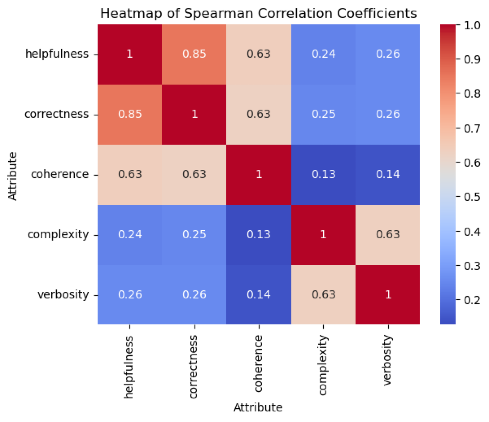

此外，正如本研究所示，即使是LLMs在不同目标方面也有自己的偏好：

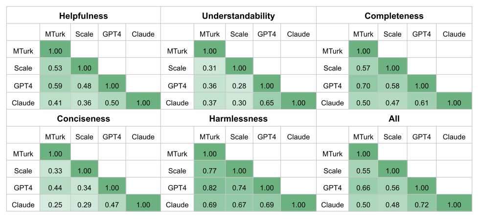

为了处理多目标 RLHF，一种流行的方法是基于参数插值，这意味着对于每个目标 $i$ ，我们可以训练一个模型 $\theta_i$ 。然后，对于具有偏好 $\nu_1, \cdots, \nu_k$ 的新用户，最终模型由以下方式给出

$$
\theta = \theta_1 \nu_1 + \cdots + \theta_k \nu_k.
$$

在参数空间中的系数组合会导致偏好目标组合，并且在实践中表现良好。然而，需要存储所有的基础模型 $\theta_1, \cdots, \theta_k$ ，并且不能使用单个模型为不同的用户群体提供服务，因此对推理不友好。

鉴于上述问题，另一个想法是将人类偏好嵌入到输入中，从而实现多目标偏好感知对齐。具体来说，我们将人类偏好建模为一个方向，即一个单位向量 $\nu \in \mathbb{R}^k$ ，并且偏好条件奖励是

$$
R(x,\nu,a) = \nu^\top r(x,a)
$$

学习目标相应地被修改为

$$
\max_{\pi} \mathbb{E}_{\nu \sim d_\nu} J(\nu, \pi) = \max_{\pi} \mathbb{E}_{\nu \sim d_\nu} \mathbb{E}_{x\sim d_0, a\sim \textcolor{red}{\pi(\cdot|x,\nu)} }[R(x,\nu, a)].
$$

面对多个用户群体，通过优化最差用户群体的偏好来考虑鲁棒偏好学习的工作也存在。

**三个要点是**

*   单奖励在表达能力上存在不足：而多目标公式可以为复杂的人类偏好（标量与向量）提供更精细的特征描述；
*   人类和LLMs具有不同的偏好：据报道，人与人之间的一致性和人与 GPT-3.5-Turbo 之间的一致性约为 60％ - 65％；
*   以人为本的偏好感知对齐：用户信息可以嵌入到输入空间中，以缓解偏好冲突。

5.3 逐点反馈 - 卡尼曼 - 特沃斯基优化
-----------------------

超越常用的 Bradley-Terry 模型的另一个方向是用逐点反馈取代成对反馈。在后一种情况下，系统只需要收集对提示 $x$ 的响应 $a$ 是否是期望的。因此，我们只需要 $(x,a, +/-)$ ，而不是收集三元组 $(x,a^+,a^-)$ 。

这样的信号收集起来的成本比收集成对响应的偏好要低得多：

1. 只需要对一个LLM进行一次前向传播以生成一个响应。另一方面，一对响应需要两次前向传播。因此，我们在为模型提供服务时节省了一半的成本。
2. 隐性反馈（ $+/-$ ）远远多于显性反馈。例如，在一个音乐人工智能中，如果用户在听了生成的歌曲的前 10 秒后跳过该歌曲，我们可以合理地认为这是负面反馈。

为了实现上述想法，Ethayarajh 等人（2024 年）提出了卡尼曼 - 特沃斯基优化（KTO）算法，该算法简要介绍如下。

前景理论（由卡尼曼和特沃斯基提出）
-----------------

与 RLHF 的核心目标不同，卡尼曼和特沃斯基的前景理论认为，人们在面对不确定事件时，并非旨在最大化预期回报。相反，由于人们是厌恶损失的，他们实际上对同等程度的损失比对收益更为敏感。

根据前景理论，一个结果的效用函数可以表述为

$$
u(Z)\triangleq\sum_{z\in Z}w_z \cdot v(z-z_{\text{ref}})
$$

其中 $Z=\{z\}$ 是表示结果的随机变量， $w$ 是一个权重函数，用于捕捉人类高估罕见事件概率的程度， $v:z\mapsto \mathbb{R}$ 是一个价值函数，用于估计结果 $z$ 相对于参考点 $z_{\text{ref}}$ 的损失/收益的敏感性。

下面，KTO 论文的作者通过我们上面讨论过的各种方法绘制了隐含的效用函数。

](implied_human_utility.png)

从 https://arxiv.org/abs/2402.01306

KTO 在实践中的目标函数
-------------

在下面，我们根据 Ethayarajh 等人（2024 年）的实践，勾勒出离线 KTO 目标函数。

$$
\ell^{\text{KTO}}(\theta) = \sum_{x,a} \left[ w(a)\left(1-v(x,a;\beta)\right) \right]
$$

这些功能的实现方式如下：

*   $w(a)= \begin{cases}
    \lambda_D &\text{if}~a\sim a_+ | x\\
    \lambda_U &\text{if}~a\sim a_- | x
    
    \end{cases}$ 其中 $\lambda_D$ 和 $\lambda_U$ 是超参数
*   $v(x,a;\beta) = \begin{cases}
    \sigma\left(r(x,a) - a_{\text{ref}}\right) &\text{if}~a\sim a_+ | x\\
    \sigma\left(- r(x,a) + a_{\text{ref}}\right) &\text{if}~a\sim a_- | x
    
    \end{cases}$ 在哪里
    *   $r(x,a)=\beta \log\frac{\pi_\theta(a|x)}{\pi_\text{ref}(a|x)}$ 采用由 DPO 工作推导得出的最优奖励函数。
    *   $a_\text{ref} = \mathbb{E}_{x'} \left[\beta D_{KL}\left[\pi_\theta(y'|x')||\pi_{\text{ref}}(y'|x') \right]\right]$ 是当前策略 $\pi_\theta$ 和参考策略 $\pi_{\text{ref}}$ 之间预期的预期 KL 散度。

这些功能的规范在很大程度上依赖于启发式方法。我们在此仅在以下部分列出作者的选择。

### implemention 这个单词拼写有误，正确的拼写应该是 implementation 。该句的正确翻译为：实施选择

*   $\beta$ 值：作者发现 $\beta = 0.1$ 在各种任务中接近最佳。另一方面，Huggingface 的 H4 团队发现 $\beta = 0.0$ 在他们的实验中能带来更好的性能。在此，我们想要强调的是，两个团队都是通过模型在任务上的性能来评估 KTO 的，这并非是使模型对齐的目标。到目前为止，根据这些证据很难判断这是否是一个普遍的好选择。
*   $\lambda_D$ 和 $\lambda_U$ ：这两个超参数的值大致与期望响应 $a_+$ 和非期望响应 $a_-$ 的比例成反比，即 $\frac{\lambda_D n_D}{\lambda_U n_U} \in [1, \frac{4}{3}]$ 。
*   $\hat{a}_{\text{ref}}$ ：在我们看来，这可能是最棘手的问题。在 KTO 论文中，作者使用大小为 $m$ 的批次通过 $\max\left( 0, \frac{1}{m}\sum\log\frac{\pi_\theta(y_U'|x')}{\pi_{\text{ref}}(y_U'|x')} \right)$ 来估计这个术语，这是一种仅具有无向响应的蒙特卡罗估计。请注意，此步骤需要相当多的浮点运算次数！

请注意，到目前为止，对 KTO 的性能评估更多地是在 MMLU 或 GSM8K 等任务上进行的，我们认为这不是最合适的方式。然而，一个非常有趣的结果是关于 KTO 的数据效率，每个提示仅一个响应。正如 Ethayarajh 等人（2024 年）在下面的表中所示，与每个提示有两个响应的 DPO 训练相比，只有一个响应的 KTO 可以显著优于它。这一发现进一步表明了 KTO 的实际价值，因为在实践中，逐点反馈更丰富且更容易收集！

](KTO-table-1.png)

从 KTO：作为前景理论优化的模型对齐

* * *

6 其他研究方向；尾注
===========

在这篇博客文章中，我们在语言模型的背景下对偏好学习进行了简要概述。还有许多其他活跃的研究主题或有趣的研究问题我们未涵盖：

*   **超级对齐 - 弱到强**
    *   当LLMs变得更加智能时，我们未来可能无法对其进行调整/监督（也许不会很快）。在这种情况下，我们仍然希望确保那些超人模型是对齐的。一个有前途的方法是使用较弱的模型来对齐较强的模型，这可以通过以下两种方式实现。
    *   监督学习：如 OpenAI 所提出和展示的，较弱的监督模型可以激发较强模型的能力，从而使得较强模型与较弱模型对齐成为可能。
    *   歧视性的世代：相比之下，郭等人（2024 年）的 OAIF 表明，弱LLMs可以提高对来自更强模型的世代响应的有用且有效的偏好，较弱的 AI 承担了一个更容易的歧视性任务。 （注：原文中LLMs可能是特定的代码或符号，在没有更多上下文的情况下，按原样保留进行了翻译。）
    *   开放性问题：我们还有其他方法来调整超人类模型吗？尤其是那些不依赖人工智能的方法。
*   **其他生成模型的偏好优化**
    *   扩散模型
    *   multi-modal LLM
*   **偏好信号构建**
    *   仅靠人类反馈不足以对超人类人工智能系统进行可扩展的监督
        *   [人类在评估总结段落时会错过超过一半的关键错误；](https://arxiv.org/pdf/2206.05802.pdf)
        *   超级对齐的从弱到强泛化；
        *   期望人类在实践中进行广泛的研究和付出努力是不可行的
    *   隐性反馈信号：在此我们以音乐人工智能（如 Suno）为例。假设用户播放一首生成的歌曲仅 5 秒钟，我们可以合理地认为该用户不喜欢它。因此，在实际中有可能从用户那里提取这种隐性反馈。
*   **用于推理的对齐**
    *   [数学推理](https://arxiv.org/pdf/2305.20050.pdf)
    *   [编码](https://arxiv.org/pdf/2403.04642.pdf)
    *   代理人；代理商；特工
*   **对齐税**
    *   [这些模型在对齐后可能会在特定任务上出现性能下降的情况。](https://arxiv.org/pdf/2203.02155.pdf)
    *   例如，校准值降低（GPT4 报告的图 8）
    *   一些初步的研究

* * *

基础生成模型的对齐仍然是一个活跃的研究方向，并正朝着通用人工智能的目标快速发展。

